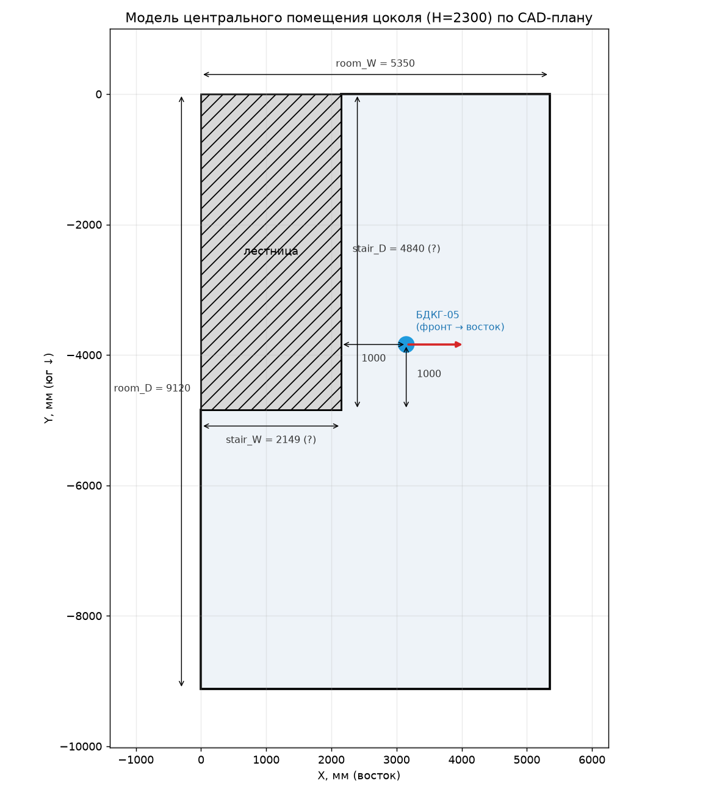
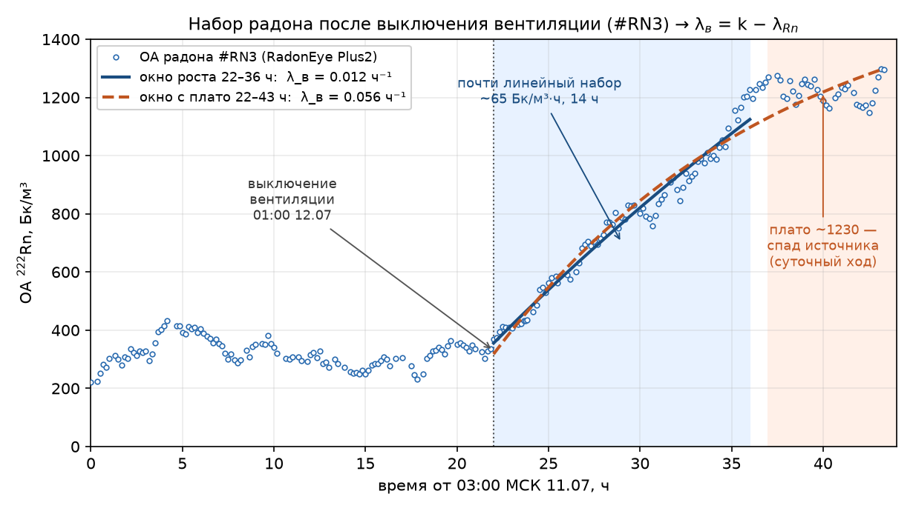
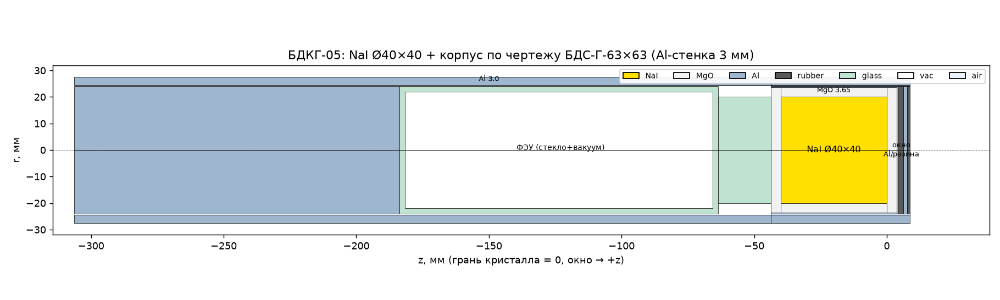
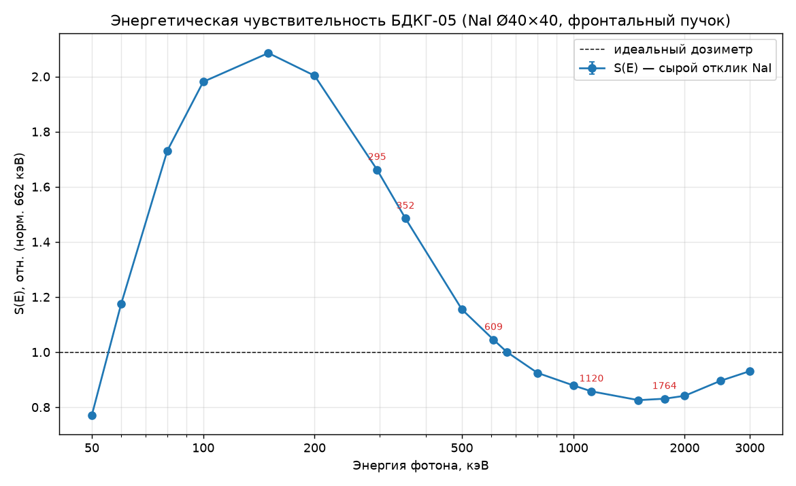
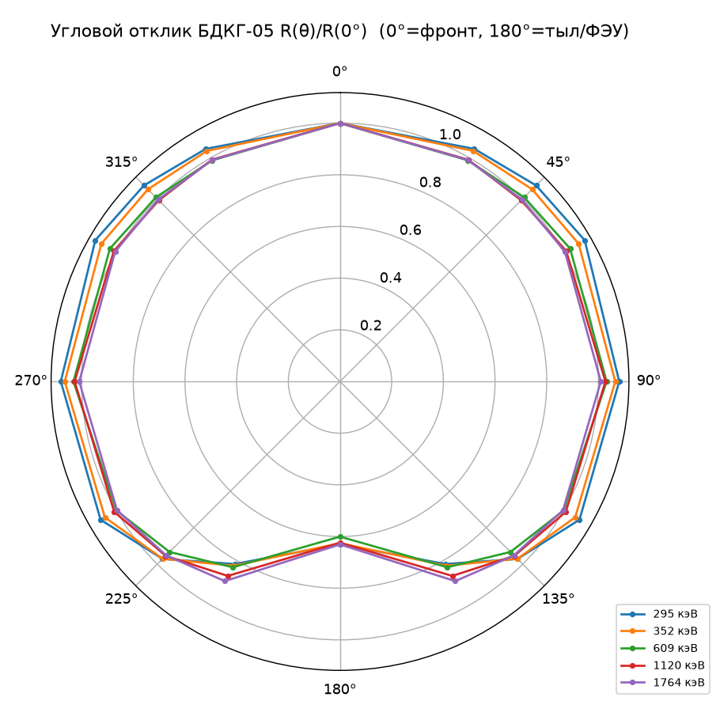
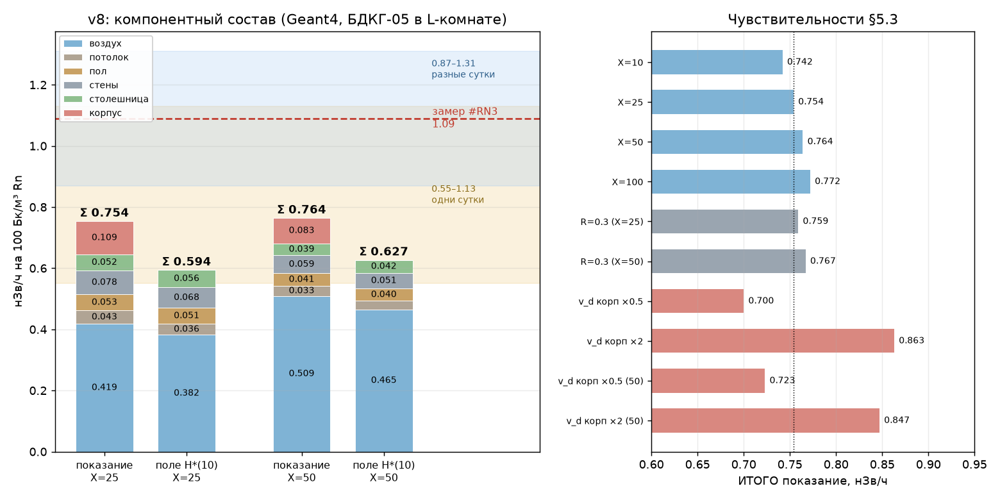
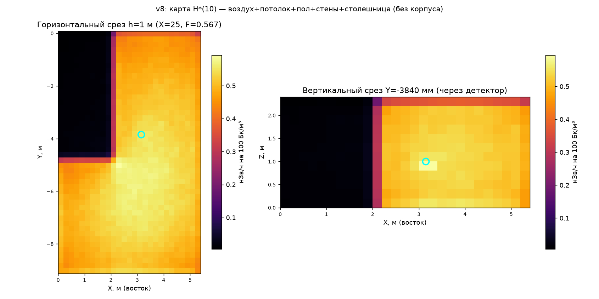

# Гамма-поле короткоживущих ДПР радона в помещении: нуклид-специфичная камерная модель, Монте-Карло верификация и сверка с натурным замером

Контур «Радоновый риск» · линия #RN4 · **v9.1** · 22.07.2026

Markdown-эквивалент веб-отчёта [RN4_report.html](RN4_report.html)
(публичная версия: https://vibeengineering-llc.github.io/demo-web-pages/radon-rn4-gamma-model-2026-07-21/)

Расчёт приращения **H\*(10)** от ²¹⁴Pb и ²¹⁴Bi на единицу ОА радона при входных величинах, восстановленных из данных эксперимента #RN3[15] (БДКГ-05), по фактической геометрии помещения. Аналитическая модель и независимый расчёт Geant4: истинное поле **≈ 0.59–0.64**, ожидаемое показание прибора **≈ 0.75–0.76 нЗв/ч на 100 Бк/м³**.

## Реферат

**Задача:** связать объёмную активность ²²²Rn с приращением мощности амбиентного эквивалента дозы Ḣ\*(10) гамма-излучения короткоживущих ДПР (²¹⁴Pb, ²¹⁴Bi) в точке детектора; независимо проверить коэффициент эксперимента #RN3[15] — +1.09 нЗв/ч на 100 Бк/м³ (95 % доверительный интервал (ДИ) 1.03–1.16; собственная погрешность детектора ±20 % расширяет полосу до 0.87–1.31).

**Приборы и помещение:** сцинтилляционный блок детектирования БДКГ-05 (кристалл NaI(Tl) Ø40×40 мм, основная погрешность ±20 %) на стальной подставке 370×420 мм (лист 1.5 мм), центр кристалла в 1.0 м от стены, высота ~1 м; монитор радона RadonEye Plus2 на том же уровне; Г-образная комната цокольного этажа по обмерам CAD-плана (охват 5.35×9.12 м, лестничный блок 2.13×4.84 в углу, высота 2.3 м, V = 88.5 м³), бетонное перекрытие пола 30 см.

**Методы:** стационарная камерная модель Jacobi с раздельными свободной и присоединённой фракциями и нуклид-специфичным осаждением по камерным измерениям Leonard (1994); кратность воздухообмена измерена по динамике набора радона после выключения вентиляции (0.01–0.07 ч⁻¹), скорость присоединения к аэрозолю задана по нормативному уровню запылённости (X = 25–50 ч⁻¹), коэффициент равновесия не задаётся, а вычисляется моделью (F = 0.57–0.68); перенос — прямое интегрирование ядра точечного источника по полному набору гамма-линий LNHB/DDEP (110 линий E ≥ 0.2 МэВ, ≥ 99 % гамма-энергии ДПР) с усреднением поля по объёму кристалла и учётом затенения лестничным блоком; комптоновское рассеяние — модель полости с дозовым альбедо бетона по формуле Чилтона–Хаддлстона; учтены экранирование стальной столешницей и осаждение на её нижнюю плоскость. Независимая верификация — численная модель прибора и помещения в Geant4 (§5): полная геометрия блока детектирования, транспорт по тем же 110 линиям, осаждение на корпус прибора, энергетический и угловой отклик.

**Вывод:** истинное поле — **0.59–0.64 нЗв/ч на 100 Бк/м³** (аналитика 0.59–0.64, Geant4 0.594–0.627 — согласие двух независимых методов); ожидаемое *показание* БДКГ-05 выше поля в ×1.22–1.27 за счёт осаждения ДПР на корпус прибора (11–14 % показания) и близких осаждённых источников: **0.75–0.76 нЗв/ч на 100 Бк/м³**. Сравнение с замером #RN3 — в тех же единицах, нЗв/ч на 100 Бк/м³: измеренный между двумя стабильными плато (вентиляция включена / выключена) коэффициент — 1.09, с приборной погрешностью ±20 % — полоса 0.87–1.31; он выше рассчитанного показания в 1.43–1.45 раза (нижний край полосы — в 1.14–1.15 раза). Вспомогательные оценки коэффициента по переходным данным отдельных суток (0.55–1.13 с той же ±20 %) накрывают рассчитанное показание. Энергетический и угловой отклик прибора по спектру ДПР искажения не вносят (свёртка 1.004); итог слабо чувствителен к запылённости и коэффициенту равновесия (сценарий F = 0.37–0.40 меняет показание на −2 %, поле на −10 %).

**Ключевые слова:** радон, дочерние продукты распада, ²¹⁴Pb, ²¹⁴Bi, коэффициент равновесия, осаждение аэрозолей, камерная модель Якоби, амбиентный эквивалент дозы H\*(10), гамма-фон помещений, дозовое альбедо, Монте-Карло, Geant4.

## 1. Введение

Гамма-фон, связанный с радоном, формирует не сам ²²²Rn (благородный газ, практически чистый α-излучатель на своём звене), а два звена его цепочки распада — ²¹⁴Pb (T½ = 26.8 мин) и ²¹⁴Bi (T½ = 19.7 мин), дающие линии от 0.24 до 2.7 МэВ. Промежуточный ²¹⁸Po (T½ = 3.1 мин) гаммой не светит, но, осаждаясь наиболее интенсивно из всех трёх, служит основным «поставщиком» поверхностной активности гамма-эмиттеров через распад на месте.

Убыль ДПР из воздуха идёт двумя каналами с противоположным дозиметрическим следствием: вентиляция *удаляет* активность из помещения, тогда как осаждение *сохраняет* её на ограждающих поверхностях, где она продолжает излучать. Соотношение каналов задаёт коэффициент равновесия F ∈ (0, 1) и распределение дозы между воздушной и поверхностной компонентами.

Мотивация работы — независимая проверка коэффициента, измеренного в эксперименте #RN3: приращение мощности амбиентного эквивалента дозы **+1.09 нЗв/ч на 100 Бк/м³** (95 % ДИ 1.03–1.16; сверх статистики — собственная погрешность детектора ±20 %, полоса 0.87–1.31, §6.1) при выключении вентиляции в подвале[15]. Построена расчётная модель «от первых принципов»: баланс ДПР в воздухе и на поверхностях → активности источников → перенос гамма-излучения к детектору → H\*(10). Входные величины по возможности восстановлены из данных самого эксперимента: кратность воздухообмена измерена по динамике набора радона, геометрия помещения — по CAD-плану здания, геометрия стенда — по фотографии, материал подставки — по факту (сталь 1.5 мм); коэффициент равновесия при этом вычисляется моделью, а не задаётся предположением.

Проверка выполнена двумя независимыми методами: аналитической моделью (камерный баланс + прямое интегрирование ядра точечного источника, §3–§4) и численным расчётом методом Монте-Карло в Geant4[19] с полной геометрией блока детектирования и помещения (§5). Второй метод дополнительно отвечает на вопросы, принципиально недоступные аналитике: вклад осаждения ДПР на корпус самого прибора и искажения его энергетического и углового отклика по спектру ДПР.

## 2. Исходные данные

**Помещение.** Г-образная комната цокольного этажа по обмерам CAD-плана здания (внутренние размеры): охватывающий прямоугольник 5.35 × 9.12 м с лестничным блоком 2.13 × 4.84 м в углу, высота 2.3 м; V = 88.5 м³, площадь пола/потолка по 38.5 м², стен — 66.6 м² (S/V = 1.62 м⁻¹). Конструктив: стена лестничного блока — кирпич 335 мм, остальные стены — бетонные блоки ФБС, все оштукатурены и оклеены флизелиновыми обоями; потолок — бетонное перекрытие; пол — паркетная доска по бетонной плите 30 см. Кирпичная стена лестничного блока (~4.7 длины свободного пробега при 0.6 МэВ) непрозрачна для гамма-излучения: часть комнаты за ней затенена и в переносе исключена.



**Рис. 1.** План комнаты по CAD-чертежу цоколя: охват 5.35 × 9.12 м, лестничный блок (штриховка) 2.13 × 4.84 м в северо-западном углу. Детектор БДКГ-05 — в 1.0 м от стены лестничного блока и в 1.0 м от её торца, фронт на восток.

**Стенд.** Детектор — сцинтилляционный блок БДКГ-05 (кристалл NaI(Tl) Ø40×40 мм) на стальной подставке 370 × 420 мм (лист 1.5 мм): центр кристалла в 1.0 м от стены лестничного блока и в 1.0 м от её южного торца (Рис. 1), на высоте ≈ 1 м, ось горизонтальна (восток–запад, тыльная часть с ФЭУ обращена к стене), 3 см над столешницей. Монитор радона RadonEye Plus2 — на том же уровне.

**Входные величины.** Кратность воздухообмена **измерена** по динамике набора радона после выключения вентиляции (метод — §3.4): λв ≈ 0.01–0.07 ч⁻¹, в расчётах принято 0.02 ч⁻¹ — помещение в этом состоянии почти герметично. Запылённость воздуха задана на нормативном уровне: ПДК по взвешенным частицам РМ2.5 (0.035 мг/м³ среднесуточно) для аккумуляционной моды ~0.2 мкм отвечает счётной концентрации ~5·10³–10⁴ см⁻³, то есть скорости присоединения ДПР к аэрозолю X ≈ 25–50 ч⁻¹[2]. Скорости осаждения — прямые камерные измерения семи бытовых материалов, нормированные на стандартную комнату[4] (v_d = λос·V/S, м/ч):

**Таблица 1. Скорости осаждения ДПР и равновесный фактор по материалам (Leonard 1994).**

| Материал | v(²¹⁸Po) | v(²¹⁴Pb) | v(²¹⁴Bi) | F |
|---|---|---|---|---|
| Бетон | 4.6 | 0.43 | 0.04 | 0.50 |
| Дерево (лак) | 5.2 | 0.60 | 0.04 | 0.47 |
| Стекло | 5.7 | 1.24 | 0.08 | 0.41 |
| Гипсокартон | 6.2 | 0.67 | 0.03 | 0.43 |
| Потолочная плитка (шероховатая) | 8.9 | 0.58 | 0.05 | 0.32 |
| Ковёр | 9.2 | 2.04 | 0.10 | 0.33 |
| Штора | 17.0 | 3.59 | 0.16 | 0.22 |

Привязка к геометрии: для осаждения работает поверхность контакта с воздухом, а не конструктив — потолок — бетон, стены — гипсокартон (гладкая бумажная поверхность флизелиновых обоев), пол — дерево (лак), подставка — стекло как ближайший гладкий непористый материал (для стали прямых данных нет; металл как проводник статический заряд не удерживает, электростатической составляющей осаждения нет). Для комптоновского рассеяния, напротив, обои и штукатурка радиационно прозрачны — работает субстрат (кирпич/бетон), поэтому альбедо принято бетонным. Ядерные данные: полный набор гамма-линий LNHB/DDEP[11] — 110 линий с E ≥ 0.2 МэВ и выходом ≥ 0.03 % (16 линий ²¹⁴Pb + 94 линии ²¹⁴Bi), покрывающих 99.5 % и 99.0 % гамма-энергии нуклидов (Σ E·y = 0.2217 из 0.2228 и 1.4532 из 1.4678 МэВ/распад); μ/ρ и μₑₙ/ρ воздуха — NIST[10]; переход керма → H\*(10) — h\*ₖ(E)[9][12].

## 3. Методы

### 3.1. Камерная модель ДПР

Помещение рассматривается как единая изотропно перемешанная камера (модель Jacobi[1], формулировка с фракциями — Porstendörfer[2]). Стационарный баланс каждого звена цепочки:

```
0 = λᵢ·Cᵢ₋₁ − (λᵢ + λв + λос,ᵢ)·Cᵢ                        (1)
```

Приход от распада родителя записан как λᵢ·Cᵢ₋₁ — с постоянной распада *дочернего* нуклида: Cᵢ₋₁ (активность родителя) равна скорости рождения *атомов* дочернего, а умножение на λᵢ переводит атомный баланс в баланс активностей.

**Обозначения к уравнению (1). Физический смысл: приход от распада родителя = полный уход (распад + вентиляция + осаждение).**

| Символ | Величина | Ед. | Значение / связь |
|---|---|---|---|
| i | индекс звена цепочки распада | — | 1 → ²¹⁸Po, 2 → ²¹⁴Pb, 3 → ²¹⁴Bi; родитель i−1 = 0 → ²²²Rn |
| Cᵢ | объёмная активность i-го ДПР в воздухе | Бк/м³ | искомая |
| λᵢ | постоянная распада i-го нуклида | ч⁻¹ | = ln2/T½; Po 13.42, Pb 1.552, Bi 2.111 |
| λв | кратность воздухообмена | ч⁻¹ | измерена: 0.01–0.07; принято 0.02 (§3.4) |
| λос,ᵢ | эффективная скорость осаждения i-го нуклида | ч⁻¹ | = Σₛ v_d,i,s·Aₛ/V (Табл. 1) |

Основная модель — полная, с раздельными *свободной* и *присоединённой* фракциями каждого ДПР: присоединение к аэрозолю со скоростью X, отрыв ²¹⁴Pb при α-распаде присоединённого ²¹⁸Po (p = 0.83[7]), нуклид- и материал-специфичное осаждение свободной фракции (Табл. 1), диффузионное осаждение присоединённой (0.1 м/ч[2]) и вертикальный член гравитационного оседания аэрозоля ±vₛ (vₛ = 0.012 м/ч для AMD ≈ 200 нм; пол/подставка +, потолок −). Коэффициент равновесия при этом не задаётся заранее, а **вычисляется** самой моделью:

```
F = 0.105·f₁ + 0.515·f₂ + 0.380·f₃, fᵢ = Cᵢ/C₀            (2)
```

где **fᵢ** — доля активности i-го ДПР (сумма фракций) относительно ОА радона C₀; **0.105, 0.515, 0.380** — весовые множители ЭРОА, доли потенциальной альфа-энергии на ²¹⁸Po, ²¹⁴Pb, ²¹⁴Bi (UNSCEAR 2000 Annex B, p. 103, § 122[8]).

Для граничных сценариев (ограничивающих оценку снизу) используется одногрупповое приближение (единая эффективная λос,ᵢ на нуклид, без разделения фракций): F фиксируется (0.3 или 0.4), а λв восстанавливается обратной задачей из (2). Расхождение одногруппового приближения с полной моделью — единицы процентов (§4.4).

### 3.2. Поверхностная активность

Активность каждого звена на поверхности следует из стационарного баланса «осаждение из воздуха + внутриповерхностное подрастание от родителя = распад». Ключевой механизм — распад осаждённого ²¹⁸Po непосредственно на поверхности; часть новорождённого ²¹⁴Pb выбивается отдачей при α-распаде обратно в воздух (фактор отскока R[4]):

```
A_Po = v_Po·C_Po/λ_Po; A_Pb = v_Pb·C_Pb/λ_Pb + (1−R)·A_Po; A_Bi = v_Bi·C_Bi/λ_Bi + A_Pb  (3)
```

**Вывод.** В установившемся режиме приход атомов на поверхность равен их убыли: λдоч·Nдоч = v_d·nвозд + (1−R)·λрод·Nрод, где nвозд = C/λдоч — атомная концентрация в воздухе, а λрод·Nрод = Aрод (каждый распад родителя рождает один атом дочернего). Левая часть — это и есть Aдоч, откуда (3). Контроль: при R = 0 и v_Pb = v_Bi = 0 формула обязана давать секулярное равновесие A_Po = A_Pb = A_Bi — тест встроен в расчётный скрипт (PASS). В полной модели приток на поверхность складывается из обеих фракций.

где **Aᵢ** — поверхностные активности, Бк/м²; **vᵢ** — скорости осаждения на данную поверхность, м/ч (Табл. 1); **Cᵢ** — объёмные активности в воздухе, Бк/м³; **R** — фактор отскока (доля ²¹⁴Pb, выбиваемая обратно в воздух при α-распаде осевшего ²¹⁸Po). Принято R = 0.5 — расчётная колонка Таблицы 1 источника[4] (теоретический максимум для плоскости); измеренные значения для материалов помещения — 0.29–0.36, бетон не измерялся (экстраполяция ~0.30). Существенно, что v_d(²¹⁴Pb) Таблицы 1 вычислены авторами *в предположении R = 0.5*, поэтому варьировать R можно только согласованной парой (R, v_d(Pb|R)): v_Pb(R) = v_Pb(0.5) − (0.5−R)·(v_Po/λ_Po)·(λ_Pb + v_Pb(0.5)/0.6818); контрольная точка — бетон: R = 0.3 → v_d(Pb) = 0.28 м/ч. Эффекты подрастания и прямого осаждения при этом противонаправлены и почти полностью компенсируются: итог по всему диапазону R = 0.29–0.55 меняется лишь на ±0.5 % (§4.4).

> **Осаждение по Якоби ≠ гравитационное оседание.** «Осаждение» (λос) — поток ДПР к поверхностям через приповерхностный пограничный слой, движимый *диффузией* (броуновской + турбулентной), а не тяжестью; оно изотропно и управляется быстрой свободной фракцией (~1 нм, v_d ≈ 5–20 м/ч). Транспорт через объём обеспечивает конвекция (5–20 см/с, оборот комнаты за десятки секунд), лимитирует последний миллиметровый погранслой: δ = D/v_d ≈ 4 мм; чистая молекулярная диффузия перенесла бы атом лишь на √(6Dτ) ≈ 9 см за время жизни. Гравитационное оседание — отдельный вертикальный механизм (vₛ ≈ 0.01 м/ч, только присоединённая фракция, только горизонтали) и в итоге пренебрежимо (< 0.5 %); реальную ориентационную асимметрию задаёт естественная конвекция — вертикальные стены осаждают в ≈ 1.8 раза сильнее горизонталей[5].

### 3.3. Перенос и дозиметрия

Флюенс в точке детектора — прямое интегрирование ядра точечного изотропного источника с экспоненциальным ослаблением в воздухе[13], раздельно по трём источникам (объём воздуха, грани помещения, подставка), каждый со своей активностью:

```
Gоб(E) = ∫_V e^(−μr)/(4πr²) dV, Gпов(E) = ∫_S e^(−μr)/(4πr²) dA  (4)
```

```
ΔḢ*(10) = Σнукл Σлиний A·y·G(E)·E·(μₑₙ/ρ)(E)·h*ₖ(E)       (5)
```

где **G(E)** — геометрические факторы объёмного (м) и поверхностного (безразмерный) источников; **μ(E)** — линейный коэффициент ослабления воздуха, м⁻¹; **r** — расстояние от элемента источника до точки расчёта; **A** — объёмная (Бк/м³) или поверхностная (Бк/м²) активность; **y** — выход линии, фотон/распад[11]; **(μₑₙ/ρ)** — массовый коэффициент поглощения энергии воздуха, м²/кг[10]; **h\*ₖ(E)** — переход воздушная керма → H\*(10), Зв/Гр[9][12]. Размерные множители опущены.

**Модель источников.** (1) Объёмный — активности ²¹⁴Pb/²¹⁴Bi равномерно по всему объёму Г-комнаты, детектор внутри. (2) Поверхностные — пол, потолок и шесть участков стен (Рис. 1), каждый со своей активностью по (3) (материал и ориентация различаются), вклады группируются «потолок / пол / стены». (3) Локальный — столешница 370×420 мм с активностью верхней плоскости; источник в сантиметрах от кристалла.

**Численное интегрирование.** Объём — сетка 5 см послойно; сингулярность ядра при r → 0 снимается аналитически: окрестность радиусом 15 см вокруг детектора интегрируется как равномерный шар, (1 − e^(−μR))/μ. Грани — сетка 5 см (минимальное r = 1.00 м — до стены лестничного блока, сингулярности нет; осевшая активность — изотропный излучатель на единицу площади, косинусные множители не вводятся). Затенение: элементы объёма и граней без прямой видимости от детектора (за кирпичной стеной лестничного блока) исключаются; торец блока обращён от детектора и вклада не даёт. Фактор G отдельных граней при 0.609 МэВ: пол 0.519, потолок 0.418, стены суммарно 0.547, из них стена лестничного блока (1.0 м от детектора) 0.299 — 55 % вклада стен, восточная стена 0.169 — 31 %; в пределе бесконечной плоскости зависимость от расстояния лишь логарифмическая, (S_A/2)·E₁(μd), отсюда слабая чувствительность итога к точному зазору детектор–стена. Подставка — сетка 5 мм, поле **усредняется по объёму кристалла** (сетка 4 мм, ~800 точек внутри цилиндра): в ближней зоне точечное приближение даёт заметную ошибку.

**Комптоновское рассеяние — модель полости.** Воздух почти прозрачен (пробег ~80 м), непоглощённый фотон попадает на ограждение, доля a_D отражается и вновь облучает комнату; сумма переотражений даёт фактор полости B(E) = 1/(1 − a_D(E)), которым умножается доза каждой линии. Интегральное дозовое альбедо бетона a_D(E) выведено из первоисточника: формула Чилтона–Хаддлстона[16] с параметрами C, C′ МК-подгонки для толстой бетонной плиты (Табл. I[18]; обзор[17]) численно проинтегрирована по полусфере отражения, отдельно для нормального падения (нижняя оценка) и изотропного облучения стен (центральная); контроль: a_D(0.662 МэВ, 0°) = 0.063 при литературных 0.06–0.08. Поправка составляет +6 % (нормальное) … +10 % (изотропное). Ограничения подхода: рассеянная добавка позиционно-независима (позиция детектора учтена только в прямой компоненте), сумма переотражений — эвристика интегрирующей сферы; строгий учёт требовал бы Монте-Карло (как в[3]).

**Стальная столешница (1.5 мм).** Сквозь столешницу к кристаллу проходит 43 % направлений — 35 % воздушного геометрического фактора и весь вклад пола; лист стали ослабляет этот нижний поток на −0.020 нЗв/ч на 100 Бк/м³ (расчёт по всем 110 линиям с наклонными толщинами, NIST-данные железа). Одновременно нижняя плоскость столешницы — поверхность осаждения в ~4.5 см от кристалла, светящая сквозь ту же сталь: +0.035…+0.045 нЗв/ч на 100 Бк/м³ (активность нижней плоскости принята как у потолка — такой же обращённой вниз поверхности). Нетто-поправка **+0.013…+0.028 нЗв/ч на 100 Бк/м³** входит в базовую оценку.

### 3.4. Измерение кратности воздухообмена

Кривая набора радона в эксперименте #RN3[15] сама содержит λв. Баланс радона в перемешанном воздухе комнаты — приход от постоянного источника S (поступление грунтового газа) за вычетом убыли по двум каналам, вентиляции и собственного распада:

```
dC/dt = S − (λв + λ_Rn)·C                                 (6)
```

При постоянном S концентрация выходит на баланс по экспоненте:

```
C(t) = C_∞ + (C₀ − C_∞)·e^(−k t), k = λв + λ_Rn, C_∞ = S/(λв + λ_Rn)  (7)
```

Постоянная распада радона известна точно (λ_Rn = ln2/T½ = 0.00755 ч⁻¹), поэтому измеренная «скорость закругления» k напрямую даёт вентиляцию: λв = k − λ_Rn. Подгонка трёхпараметрическая: при каждом пробном k — линейный МНК по базису {1, e^(−k t)} (даёт C_∞ и C₀), выбирается k с наименьшей невязкой; 95%-полоса — по профилю невязки.



**Рис. 2.** Набор ²²²Rn после выключения вентиляции (RadonEye Plus2, #RN3). До эксперимента (0–20 ч) виден суточный ход источника при работающей вентиляции. С 01:00 12.07 (x = 22 ч) — почти линейный набор ~65 Бк/м³·ч в течение 14 ч без выполаживания. Резкое плато ~1230 Бк/м³ с 16:00 — суточный спад поступления грунтового газа, а не вентиляционный баланс. Линии — подгонка ур. (7) в двух окнах.

Почти линейный рост в течение 14 часов без выполаживания — признак почти герметичного помещения: постоянная времени τ = 1/k велика по сравнению с окном наблюдения, и видна лишь ранняя, слабо изогнутая часть экспоненты. Результат подгонки зависит от того, включать ли плато:

**Подгонка кривой набора в двух окнах (λ_Rn = 0.00755 ч⁻¹).**

| Окно подгонки | Точек | k, ч⁻¹ | C_∞, Бк/м³ | λв = k − λ_Rn, ч⁻¹ |
|---|---|---|---|---|
| Чистый рост (22–36 ч) | 79 | 0.020 | 3504 (нефизично) | 0.012 [0.012–0.021] |
| С плато (22–43 ч) | 118 | 0.064 | 1638 | 0.056 [0.043–0.070] |

В окне чистого роста кривая почти прямая, асимптота не определяется — экстраполяция даёт нефизично высокое C_∞ ≈ 3500 Бк/м³; окно надёжно говорит лишь, что λв мал (≲ 0.02 ч⁻¹). В окне с плато формальная подгонка объясняет выполаживание вентиляционным балансом и поднимает λв до 0.056, но плато наступает резко (за ~1 ч) и точно в суточный максимум — это спад источника, а не гладкое экспоненциальное насыщение (тот же суточный ход виден и до эксперимента), поэтому 0.056 — верхняя граница. Итоговая оценка **λв ≈ 0.01–0.07 ч⁻¹**, физически — почти герметичное помещение (λв ≲ 0.05); лаг RadonEye ~30 мин на фоне 14-часового набора пренебрежим. В расчётах принято λв = 0.02 ч⁻¹; чувствительность итога к диапазону 0.01–0.05 — +0.8…−2.3 % (§4.4), поскольку при столь слабом воздухообмене баланс ДПР задаётся осаждением, а не вентиляцией. Этот результат исключает и попытку объяснить наблюдаемое неравновесие одной вентиляцией без осаждения — потребовалась бы λв ≈ 1.4–2.6 ч⁻¹ (§6.3).

### 3.5. Контроль вычислений

В расчётный скрипт встроены обязательные проверки: тест секулярного равновесия для (3) (при R = 0 и нулевом прямом осаждении A_Po = A_Pb = A_Bi; при провале — аварийный останов), контроль невязки |F − Fцель| после бисекции в решателях. Воздушная компонента дополнительно верифицирована независимой угловой квадратурой (1.28·10⁶ лучей, радиальный интеграл аналитический — сингулярности нет в принципе): совпадение с сеточным методом +0.4 %. Сходимость сеток: измельчение вдвое меняет фактор граней в 5-м знаке, подставки — на 0.04 %. Линейность дозы по ОА радона точна алгебраически и подтверждена экспериментально (v_d не зависит от ОА[6]).

## 4. Результаты

### 4.1. Коэффициент равновесия, вычисленный моделью

При измеренной вентиляции коэффициент равновесия определяется запылённостью — скоростью присоединения ДПР к аэрозолю X (§3.1):

**Таблица 2. Коэффициент равновесия и свободная доля ²¹⁸Po как функции запылённости (λв = 0.02 ч⁻¹).**

| X (присоединение к аэрозолю), ч⁻¹ | Уровень запылённости | F (вычислен) | Свободная доля ²¹⁸Po |
|---|---|---|---|
| 5 | очень чистый воздух | 0.30 | 0.73 |
| 10 | чистый воздух | 0.41 | 0.58 |
| 25 | ≈ ПДК РМ2.5 | 0.57 | 0.35 |
| 50 | типичное жильё | 0.68 | 0.21 |
| 100 | запылённое | 0.76 | 0.12 |

Базовый диапазон X = 25–50 даёт F = 0.57–0.68 (ЭРОА 57–68 Бк/м³ на 100 Бк/м³ ОА). Запылённость в помещении не измерялась, поэтому F здесь — расчётная величина при нормативном аэрозоле. Прямые измерения коэффициента равновесия в помещениях с отключённой вентиляцией дают F = 0.35–0.45[21]; в рамках модели при измеренной λв = 0.02 ч⁻¹ такие значения отвечают чистому воздуху (X ≈ 8–10 ч⁻¹) и рассмотрены как отдельный сценарий (§4.3, §4.4). Достичь F ≤ 0.45 вентиляцией при нормативном аэрозоле нельзя — потребовалась бы λв ≈ 0.7–1 ч⁻¹, исключённая измеренной динамикой набора (§3.4).

### 4.2. Активности в воздухе и на поверхностях

**Таблица 3. Объёмная активность ДПР в воздухе (Бк/м³ на 100 Бк/м³ Rn; сумма свободной и присоединённой фракций).**

| Нуклид | X = 25 | X = 50 |
|---|---|---|
| ²¹⁸Po | 80.4 | 86.7 |
| ²¹⁴Pb | 56.2 | 67.9 |
| ²¹⁴Bi | 51.0 | 62.3 |

**Таблица 4. Поверхностная активность ²¹⁴Pb / ²¹⁴Bi (Бк/м² на 100 Бк/м³ Rn).**

| Поверхность | ²¹⁴Pb (X = 25) | ²¹⁴Bi (X = 25) | ²¹⁴Pb (X = 50) | ²¹⁴Bi (X = 50) |
|---|---|---|---|---|
| Потолок (бетон) | 19.2 | 21.7 | 14.1 | 16.9 |
| Стены (обои) | 25.5 | 28.4 | 18.4 | 21.5 |
| Пол (паркет) | 22.2 | 25.4 | 16.6 | 20.1 |
| Подставка (сталь) | 23.1 | 26.3 | 17.1 | 20.6 |

Рост запылённости перекачивает активность с поверхностей в воздух: аэрозоль перехватывает ²¹⁸Po до осаждения (свободная доля 0.35 → 0.21), поверхностное подрастание гаснет, воздушные ²¹⁴Pb/²¹⁴Bi растут. В точке измерения эти сдвиги почти компенсируются в дозе (§4.4).

### 4.3. Мощность дозы

**Таблица 5. Приращение ΔḢ\*(10) по компонентам и базовая оценка (нЗв/ч на 100 Бк/м³ Rn).**

| Компонента | X = 25 | X = 50 |
|---|---|---|
| Воздух комнаты | 0.332 | 0.405 |
| Потолок (бетон) | 0.027 | 0.021 |
| Стены (обои) | 0.047 | 0.035 |
| Пол (паркет) | 0.040 | 0.031 |
| Подставка (сталь, верх) | 0.081 | 0.063 |
| Прямые фотоны, итого | 0.527 | 0.555 |
| + комптон (изотропное альбедо) | 0.579 | 0.610 |
| + столешница (экран −0.020; нижняя плоскость +0.035…+0.045) | +0.015…+0.025 | +0.015…+0.025 |
| Базовая оценка поля | 0.59–0.60 | 0.63–0.64 |

**Базовая оценка истинного поля: 0.59–0.64 нЗв/ч на 100 Бк/м³, центральное значение ≈ 0.61.** При высоком равновесии доминирует воздушная компонента (63–73 % прямых фотонов); подставка — крупнейший единичный поверхностный источник (большой телесный угол вплотную к кристаллу). Это оценка *поля* — без инструментальных эффектов самого прибора (осаждение на корпус, §5); альбедо-модель полости даёт нижнюю оценку рассеяния: физический расчёт комптона поднимает поле на +2.5–2.8 % (§5.3).

**Сценарий F = 0.37–0.40 (чистый воздух).** Прямым измерениям коэффициента равновесия при отключённой вентиляции (F = 0.35–0.45) в модели отвечает X ≈ 8–10 ч⁻¹: поле 0.52–0.53 нЗв/ч на 100 Бк/м³, т.е. лишь на 9–12 % ниже базы — убыль воздушной компоненты (0.37 → 0.22–0.24, с альбедо) почти компенсируется ростом поверхностной (0.21 → 0.29–0.31): ДПР, не найдя аэрозоля, осаждаются на стены и подставку вокруг детектора и продолжают излучать. Показание прибора при этом меняется ещё слабее — на −2 % (§5.4).

### 4.4. Бюджет неопределённостей

**Таблица 6. Чувствительность базовой оценки поля к входам и приближениям (относительно ≈ 0.61).**

| Фактор | Эффект | Комментарий |
|---|---|---|
| Сценарий F = 0.37–0.40 (X = 8–10, чистый воздух) | −9…−12 % | **крупнейшая неопределённость поля**; по прямым измерениям F при отключённой вентиляции[21]; показание прибора −2 % (§5.4) |
| Электростатика обоев: гипотетическое усиление v_d(стены) ×2 / ×3 | −9.2 % / −16.6 % | расчётный гипотетический случай; при факте T ≈ 24 °C, RH 52–55 % заряд стекает (влажностная проводимость + ионизация воздуха) — эффект подавлен, ожидаемый вклад 0…−3 % |
| Вариант альбедо (нормальное вместо изотропного) | −4 % | нижняя оценка комптона |
| Физический комптон (Geant4) вместо альбедо-модели | +2.5…+2.8 % | рассеянная доля поля 14.5–15.1 % (§5.3) |
| Запылённость X = 25 ↔ 50 | −3…+2 % | компенсация «воздух ↔ поверхности» в точке измерения |
| Кратность воздухообмена 0.01 ↔ 0.05 ч⁻¹ | +0.8…−2.3 % | измеренный диапазон |
| Материал подставки в осаждении (стекло → бетон) | −1…−2 % | пересчитано на Г-геометрии полной моделью фракций; для стали прямых данных нет |
| Пол: паркет ↔ бетон (материал осаждения) | +0.5 % | паркетная доска лежит по бетонной плите |
| Поправка столешницы (диапазон нетто) | ±1 % | +0.015…+0.025 нЗв/ч на 100 Бк/м³ |
| Ориентация поверхностей (конвекция)[5] | −7…0 % | протокол-зависимо, знак неустойчив; оценка на прямоугольной геометрии v8 |
| Фактор отскока R = 0.29–0.55 (согласованно с v_d(Pb\|R)) | ±0.5 % | каналы компенсируются (§3.2) |
| Усечение спектра до 11 главных линий | −26 % | не допускается: включён полный набор (110 линий); свойство спектра, оценка на геометрии v8 |
| Гравитационное оседание аэрозоля | < 0.5 % | пренебрежимо; оценка на геометрии v8 |

**Оговорка о позиционной зависимости.** Слабая чувствительность к запылённости — свойство точки измерения (детектор у подставки и стены видит воздушный и поверхностный «этажи» с сопоставимым весом), а не помещения: в центре комнаты воздушная доля 63–89 % и рост X на порядок меняет дозу на +37 %.

## 5. Численная верификация: Монте-Карло модель прибора и помещения (Geant4)

Аналитическая модель §3–§4 вычисляет поле в точке, но не отвечает на два вопроса о самом приборе: сколько добавляет к показанию осаждение ДПР на его корпус (ближний источник вплотную к кристаллу) и не искажает ли показание энергетический и угловой отклик NaI(Tl) по спектру ДПР. Оба вопроса требуют транспорта фотонов через реальную геометрию блока детектирования — они решены методом Монте-Карло в Geant4 11.2[19][20] (электромагнитная физика высокой точности option4, порог 0.3 мм) как независимая верификация: отдельная реализация камерной модели, отдельный инструментарий, сверка с аналитикой только по контрольным точкам.

### 5.1. Модель прибора и инструментальный отклик

Геометрия блока БДКГ-05 построена по чертежу родственного блока детектирования с заменой кристалла на Ø40×40 мм: NaI(Tl) + отражатель MgO 3.65 мм + Al-стакан, воздушный зазор, стенка корпуса Al 3 мм, входное окно (MgO/Al/резина), ФЭУ-хвост (стекло + вакуум); полная длина 315 мм (Рис. 3). Показание моделируется как энерговыделение в кристалле с пересчётом в нЗв/ч через калибровку прибора по Cs-137.



**Рис. 3.** Модель блока БДКГ-05 в Geant4: кристалл NaI(Tl) Ø40×40 мм, отражатель MgO, Al-корпус 3 мм, входное окно, ФЭУ-хвост.

**Энергетическая чувствительность.** Отклик на единицу H\*(10) фронтального пучка имеет пик ×2.1 при 100–150 кэВ — некомпенсированный NaI (Рис. 4). Однако жёсткий спектр ДПР этим пиком практически не задевается: свёртка S(E) по полному спектру ²¹⁴Pb + ²¹⁴Bi даёт коэффициент **1.004** — прибор считывает H\*(10) поля ДПР без искажения.



**Рис. 4.** Энергетическая чувствительность S(E) на единицу H\*(10) (нормировка на 662 кэВ). Красным отмечены главные линии ДПР — они лежат в области, где отклик близок к единице; свёртка по полному спектру ДПР — 1.004.

**Угловой отклик.** R(θ)/R(0°) на линиях ДПР 295–1764 кэВ: фронт–бок ±9 %, тыл 0.60–0.63 (экранировка ФЭУ-хвостом); свёртка по изотропному полю −3…+2 % (Рис. 5). Совместно с энергетическим откликом (1.004 × (0.97…1.02) = 0.97…1.03) инструментальные отклики в изотропном поле искажения не вносят — единицы процентов; паспортная оценка углового отклика (+3.5…+5.9 %, §6.3) — того же порядка.



**Рис. 5.** Угловой отклик R(θ)/R(0°) на пяти линиях ДПР (0° — фронт, 180° — тыл/ФЭУ).

### 5.2. Сцена и схема расчёта

Сцена — фактическая Г-комната по CAD-плану (Рис. 1): бетонные ограждения 300 мм (физический источник комптоновского рассеяния), кирпичный лестничный блок 335 мм, стальная столешница 1.5 мм, прибор в фактической позиции и ориентации. Камерная модель §3.1 реализована заново, независимым кодом, и сверена с аналитикой по контрольным точкам: коэффициент равновесия и все табличные активности воспроизведены (F = 0.567/0.677 против 0.568/0.677 аналитики). Транспорт разделён со свёрткой: Geant4 считает отклик на один фотон каждого источника (объём воздуха, пол, потолок, стены, столешница, корпус; до 5·10⁷ фотонов на прогон) по полному набору 110 линий LNHB/DDEP, а активности камерной модели прикладываются постобработкой — все чувствительности получаются из одних и тех же прогонов. Статистическая погрешность воздушных компонент 2–3 %, осаждённых — доли процента. Геометрии методов различаются в мелочах (аналитика: лестничный блок 2130 мм, V = 88.51 м³; Geant4: блок 2149 мм, V = 88.3 м³ — CAD-неувязка 19 мм): расхождение объёмов 0.2 %, пренебрежимо.

**Кросс-проверка транспорта:** прямая воздушная компонента поля — 0.3325/0.4050 (Geant4) против 0.332/0.405 (аналитика, Табл. 5) при X = 25/50 — совпадение лучше 1 % двумя независимыми методами.

### 5.3. Показание и истинное поле

**Таблица 7. Показание БДКГ-05 и истинное поле H\*(10) по компонентам, Geant4 (нЗв/ч на 100 Бк/м³ Rn). Компоненты округлены до трёх знаков; итоги — по неокруглённым значениям.**

| Источник | X = 25 |  | X = 50 |  |
|---|---|---|---|---|
| показание | поле | показание | поле |  |
| Воздух комнаты | 0.419 | 0.382 | 0.509 | 0.465 |
| Потолок | 0.043 | 0.036 | 0.033 | 0.028 |
| Пол | 0.053 | 0.052 | 0.041 | 0.040 |
| Стены | 0.078 | 0.068 | 0.059 | 0.051 |
| Столешница | 0.052 | 0.056 | 0.039 | 0.042 |
| Корпус прибора | 0.109 | — | 0.083 | — |
| ИТОГО | 0.754 | 0.594 | 0.764 | 0.627 |

**Осаждение на корпус** даёт 0.083–0.109 нЗв/ч на 100 Бк/м³ — **11–14 % показания**, крупнейший вклад, отсутствующий в аналитике принципиально. Вместе с близкими осаждёнными источниками (столешница, ближняя стена) он объясняет, почему показание прибора систематически выше истинного поля в точке: **×1.22–1.27** (Рис. 6). Истинное поле Geant4 — 0.594/0.627 — согласуется с аналитикой (0.579/0.610, Табл. 5) с точностью +2.5–2.8 %; разница — итог двух встречных эффектов: физическое рассеяние больше альбедо-оценки (рассеянная доля поля **14.5–15.1 %** против +10 % модели полости — альбедо-оценка нижняя), а вклад столешницы у Geant4 меньше, что её частично компенсирует.



**Рис. 6.** Компонентный состав показания БДКГ-05 и истинного поля H\*(10) при X = 25/50 на фоне полос замера #RN3 (слева); чувствительности показания (справа).

Пространственные карты H\*(10) по комнате (сетка 200 мм) подтверждают доминирование воздушной компоненты: поле плоское, градиенты — только у поверхностей и столешницы; карта в точке детектора сверена с независимым сферическим оценщиком (расхождение ~1.5 %) (Рис. 7).



**Рис. 7.** Карта H\*(10) (без вклада корпуса): горизонтальный срез на высоте 1 м и вертикальный срез через детектор. Тёмная зона — лестничный блок.

### 5.4. Чувствительности показания

Все вариации — из тех же прогонов транспорта (постобработкой): запылённость X = 10/25/50/100 ч⁻¹ → показание 0.742/0.754/0.764/0.772 нЗв/ч на 100 Бк/м³ — **±2 % на декаду X**: рост воздушной компоненты компенсируется падением осаждённых, включая корпус (то же свойство точки измерения, что и у аналитики, §4.4). В частности, сценарию F = 0.37–0.40 (X ≈ 10, §4.1) отвечает показание 0.742 — лишь на 2 % ниже базового. Фактор отскока R = 0.3 (согласованной парой) — +0.4…+0.6 %. Единственный значимый фактор — скорость осаждения на корпус: v_d(корпус) ×0.5 / ×2 → −5…−7 % / +11…+14 % (для стали и алюминия прямых измерений v_d нет, принято стекло как ближайший гладкий непористый материал). Пустотность плит перекрытия проверена дельта-прогоном: +0.3 %, пренебрежимо.

> **Интерактивное приложение.** Трёхмерная модель помещения с прибором и калькулятором поля по результатам этой главы — [3D-модель помещения с калькулятором](https://vibeengineering-llc.github.io/demo-web-pages/radon-room-calculator-3d/): геометрия комнаты и стенда, компоненты показания и поля, интерактивный пересчёт под свои параметры.

### 5.5. Вычислительная инфраструктура и роль расчётного агента

Монте-Карло часть работы (§5) выполнена отдельным вычислительным контуром под управлением ИИ-агента (Claude Code, модель Anthropic Claude) по заданию и под контролем оператора. Организационно это ключ к независимости верификации: аналитическая линия #RN4 (§3–§4) и линия Geant4 (§5) велись как разные контуры с раздельной реализацией камерной модели и разным инструментарием — сверка шла только по контрольным точкам (§5.2), поэтому совпадение промежуточных величин (воздушная компонента поля — лучше 1 %, коэффициент равновесия — в третьем знаке) не может быть следствием общей ошибки кода. Агент самостоятельно собрал тулкит, написал геометрию, физику и скоринг на C++, управлял прогонами и выполнил свёртку и построение фигур; научные решения (входы v8, материалы, позиция прибора, разрешение разночтений спецификации) принимались оператором.

**Сборка Geant4 на Windows.** Использована официальная сборка CERN Geant4 11.2.1 [MT] под Windows (пакет `WIN32-VC17`), компилятор MSVC v143 (Build Tools 2022), система сборки CMake + Ninja; датасеты низкоэнергетической электромагнитной физики (`G4EMLOW` и др.) — из дистрибутива CERN. Две особенности среды потребовали обхода. Во-первых, кириллица в системных путях профиля пользователя ломает инсталляторы и кэши сборки — всё научное окружение вынесено в ASCII-пути (`C:\geant4`, `C:\g4work`, `C:\g4temp`). Во-вторых, в prebuilt-архиве нет import-библиотек (`.lib`) и `Geant4Config.cmake`, поэтому линковаться штатным `find_package` не с чем: import-библиотеки сгенерированы вручную из DLL (`dumpbin /exports` → `.def` → `lib /def:`), а проекты линкуются напрямую списком библиотек с определением `G4LIB_BUILD_DLL`. Работоспособность сборки подтверждена аналитическими проверками (флюенс точечного источника 1/4πr², массы объёмов) до постановки физических задач.

**Управление прогонами.** Всё управление — консольное, без GUI. Окружение поднимает один скрипт (`vcvars64` + CMake/Ninja + переменные `G4*DATA`); каждая задача — небольшой проект `main.cc` + `CMakeLists`, параметры прогона задаются аргументами командной строки (`<режим> <источник> <нуклид> <число фотонов>`), физический лист — `G4EmStandardPhysics_option4`, порог 0.3 мм. Тяжёлые прогоны (до 5·10⁷ фотонов) шли пакетами фоновых процессов, по одному ядру на процесс; итоговые строки логов — в машинно-читаемом виде, их собирает Python-постобработка (`numpy`/`matplotlib`), где транспорт сворачивается с активностями камерной модели. Разделение «транспорт по нуклидам → свёртка с активностями постобработкой» (§5.2) — сознательное проектное решение: оно позволило получить все чувствительности §5.4 из одних и тех же прогонов, без повторного транспорта. Методическая деталь, найденная при отладке карт поля (Рис. 7): трек-длинный оценщик со свободным шагом даёт ложный «горячий слой» на середине высоты (весь пролёт фотона в разреженном воздухе относится к одной ячейке середины шага); лечится ограничением шага 100 мм (`G4StepLimiter`), после чего значение в точке прибора сходится с независимым сферным оценщиком в пределах ~1.5 %.

## 6. Сравнение с экспериментом #RN3

### 6.1. Целевые величины и их погрешности

Эксперимент #RN3 (выключение вентиляции, рост ОА радона 318 → 1193 Бк/м³) измерил коэффициент связи МЭД с ОА **между двумя стабильными плато** — уровнем при работающей вентиляции и верхним плато после набора при выключенной: **+1.09 нЗв/ч на 100 Бк/м³** (95 % ДИ 1.03–1.16)[15]. На стабильных уровнях ДПР находятся в равновесии со своей ОА, поэтому именно эта величина является измерением коэффициента. Вспомогательные оценки — регрессия МЭД по ОА на переходных данных набора внутри одних суток (свободна от примеси суточного хода температуры, но взята на нестационарных данных) — ниже: 0.94 ± 0.34 (p = 0.013) и 0.69 ± 0.47 (незначимо), центральные значения 0.69–0.94.

Доверительный интервал 1.03–1.16 отражает только статистический разброс точек. Сверх него у замера есть погрешность самого прибора: по паспорту **основная относительная погрешность БДКГ-05 — ±20 %** (калибровка по эталону Cs-137). Она смещает все показания МЭД одним общим множителем, поэтому и коэффициент связи МЭД с ОА масштабируется целиком на те же ±20 %, независимо от статистики. С учётом ±20 % измеренный коэффициент расширяется до полосы **0.87–1.31**, вспомогательные посуточные оценки — до **0.55–1.13** нЗв/ч на 100 Бк/м³.

**Отношение сигнал/фон.** Полезный эффект мал на фоне полной МЭД: за время эксперимента показание БДКГ-05 менялось в пределах 69–83 нЗв/ч, то есть радоновое приращение составило до ~14 нЗв/ч (~20 % фона) в пике набора, а бо́льшую часть времени — единицы процентов. Поэтому вариации фона порядка единиц нЗв/ч (внешнее гамма-поле, приборные дрейфы) конкурируют с сигналом, и статистический ДИ занижает реальную неопределённость коэффициента.

### 6.2. Сопоставление

**Таблица 8. Модель против натурного замера (нЗв/ч на 100 Бк/м³).**

| Источник | Значение | Отношение |
|---|---|---|
| Истинное поле, аналитика (Табл. 5) | 0.59–0.64 (центр 0.61) | — |
| Истинное поле, Geant4 (Табл. 7) | 0.594–0.627 | +2.5–2.8 % к аналитике (рассеяние) |
| **Показание прибора, Geant4** (поле + корпус + отклик) | 0.754–0.764 | ×1.22–1.27 к полю |
| Сценарий F = 0.37–0.40 (X ≈ 10): поле (без поправки столешницы) / показание | 0.53 / 0.742 | −10 % / −2 % |
| Измеренный коэффициент, плато–плато (стат. ДИ) | 1.09 (1.03–1.16) | ×1.43–1.45 к показанию |
| Измеренный коэффициент + инстр. ±20 % | 0.87–1.31 | ×1.14–1.15 к нижнему краю |
| Вспом. оценки по переходным данным суток + инстр. ±20 % | 0.55–1.13 | **показание внутри диапазона** |

С замером корректно сравнивать не поле, а *ожидаемое показание прибора* — 0.754–0.764 нЗв/ч на 100 Бк/м³ (§5.3): коэффициент #RN3 получен по показаниям того же БДКГ-05, в которые входят и осаждение на корпус, и отклик прибора. Показание **лежит внутри диапазона вспомогательных посуточных оценок** (0.55–1.13 нЗв/ч на 100 Бк/м³). К измеренному коэффициенту (плато–плато) остаётся умеренный разрыв: 1.09 выше рассчитанного показания в 1.43–1.45 раза, нижний край инструментальной полосы 0.87 — в 1.14–1.15 раза. Физический механизм (гамма ДПР радона) подтверждён количественно двумя независимыми методами.

### 6.3. Проверенные и исключённые механизмы

- **Осаждение на корпус прибора** — переведено из гипотез в число: 11–14 % показания (§5.3), учтено в ожидаемом показании.
- **Энергетический отклик БДКГ-05 по спектру ДПР** — исключён Монте-Карло расчётом: свёртка чувствительности по полному спектру ДПР даёт 1.004 (§5.1).
- **Угловой отклик БДКГ-05** — паспортная Табл. Г.6 (свёртка по изотропному полю +3.5 % Co-60 … +5.9 % Cs-137) и Монте-Карло (−3…+2 %, §5.1) оба дают эффект в единицы процентов — кандидатом не является.
- **Рост скоростей осаждения гамма-эмиттеров** (литературный разброс v_d до 2.0–3.5 м/ч против принятых 0.43–1.24 (стены/пол/потолок 0.43–0.67, стекло-прокси подставки и корпуса 1.24)[4][6]) ограничен связкой с балансом воздуха: усиленное осаждение выедает ²¹⁴Pb/²¹⁴Bi из воздуха и опускает F; заметного роста дозы этот механизм не даёт.
- **Нулевое осаждение** исключено: удержание наблюдаемого неравновесия одной вентиляцией потребовало бы λв ≈ 1.4–2.6 ч⁻¹ (F = 0.45…0.30; полный воздухообмен каждые 23–43 минуты), что противоречит измеренной динамике; доза при этом упала бы в разы.
- **ДПР торона** (²¹²Pb, ²⁰⁸Tl 2.61 МэВ) — исключены прямым измерением: аэрозольный радиометр АльфаАэро значимой ЭРОА ДПР торона в помещении не выявил.

### 6.4. Кандидаты остатка к измеренному коэффициенту

Показание модели (0.75–0.76) согласуется с вспомогательными посуточными оценками; разрыв в 1.43–1.45 раза остаётся к измеренному коэффициенту (1.09). Возможные вклады в этот остаток:

1. **Скорость осаждения на корпус прибора** — главная расчётная неопределённость показания: v_d для стали/алюминия прямо не измерена, вариация ×2 даёт +11…+14 % (§5.4).
2. **Вариабельность самого замера** — сигнал мал относительно фона (§6.1), и сравнение двух плато, разнесённых на сутки, включает межсуточные изменения фона, которых нет в посуточных оценках.
3. **Гамма из-под пола, коррелированная с ОА.** Средний уровень подпольной гаммы (ДПР в грунте сквозь 30 см бетона, 3.3–6.9 длин пробега, с фактором накопления[14]) мал — 0.06–0.16 нЗв/ч при 20–50 кБк/м³ в грунте, и его постоянная часть в коэффициент #RN3 не входит (регрессия вычитает константу). Однако активность ДПР в грунте под зданием и ОА в комнате управляются общим драйвером — динамикой грунтового газа: коррелированная с ОА часть подпольного поля регрессией не вычитается и входит в измеренный коэффициент. Величина этой вариации в работе не оценивалась.
4. **Внешнее гамма-поле** — ДПР радона в приземном воздухе и грунте вокруг здания; вымывание ДПР осадками способно менять фон на величины, сопоставимые с сигналом (§7).

## 7. Ограничения

- Изотропно перемешанный воздух, установившийся режим (переходные процессы 3–4 ч после смены вентиляции не моделируются).
- Кратность воздухообмена измерена в предположении постоянного источника; суточный ход поступления грунтового газа учтён только расширением диапазона λв.
- **Коэффициент равновесия F независимо не измерялся** — он вычислен моделью при нормативной запылённости (X = 25–50 ч⁻¹, сама запылённость тоже не измерялась). Сценарий по прямым измерениям F при отключённой вентиляции (0.35–0.45[21]) учтён в бюджете: −9…−12 % поля, −2 % показания (§4.3, §5.4). Прямая проверка — одновременный замер ОА (RadonEye) и ЭРОА (АльфаАэро): F = ЭРОА/ОА.
- Комптон в аналитике — модель полости с дозовым альбедо (без углового и спектрального разрешения рассеянной компоненты); альбедо выведено из первоисточников[16][18]; физический расчёт (§5.3) показывает, что это нижняя оценка (+2.5–2.8 % к полю).
- Излучение с E < 0.2 МэВ не включено (нижняя граница таблиц модели): гамма ²¹⁴Pb 53–196 кэВ и K-рентген висмута 75–90 кэВ — керма-взвешенно ≈ 2 % итога; слабые линии с выходом < 0.03 % — ещё ≈ 1 % энергии.
- Скорости осаждения привязаны по типу поверхности, а не измерены для конкретных материалов; для стали подставки и корпуса прибора взяты данные стекла — ближайшего гладкого непористого материала (§2); отсюда главная чувствительность показания v_d(корпус) ×0.5/×2 → −7…+14 % (§5.4).
- Геометрия блока детектирования в Geant4 — по чертежу родственного блока с заменой кристалла; внутренние узлы ФЭУ упрощены.
- Торон (²²⁰Rn) и его ДПР в модель не включены (вклад исключён замерами, §6.3).
- Инструментальная погрешность БДКГ-05 (±20 %) отнесена к целевой величине замера (полоса), не к модели.
- Оценивается только приращение от ДПР радона; постоянная часть природного фона (космика, ⁴⁰K, ряды U/Th, подпольная гамма) в коэффициент #RN3 не входит. Вариации фона, коррелированные с ОА или совпавшие по времени с набором (перераспределение ДПР в грунте под зданием, внешнее поле при осадках), регрессией не вычитаются — условие корректности замера включает сухую погоду в период измерений (§6.4).
- Предельная схема эксперимента, свободная от связи «источник в грунте ↔ поле из-под пола», — подача радона в комнату от удалённого источника, не влияющего на измеряемую МЭД.

## 8. Выводы

1. Построена стационарная камерная модель гамма-поля ДПР радона с раздельными фракциями, нуклид- и материал-специфичным осаждением и переносом по полному набору гамма-линий LNHB/DDEP (110 линий, ≥ 99 % гамма-энергии) — по фактической Г-образной геометрии помещения (V = 88.5 м³, затенение лестничным блоком). Входные величины восстановлены из данных эксперимента: кратность воздухообмена измерена по динамике набора радона (λв ≈ 0.01–0.07 ч⁻¹ — почти герметичный режим), коэффициент равновесия вычислен моделью: F = 0.57–0.68 при нормативной запылённости.
2. Выполнена независимая численная верификация в Geant4 с полной геометрией блока детектирования и помещения. Кросс-проверка двух методов: воздушная компонента поля совпала лучше 1 %, коэффициент равновесия — в третьем знаке. Энергетический и угловой отклик БДКГ-05 по спектру ДПР искажения не вносят (свёртка 1.004; изотропная свёртка углового отклика −3…+2 %).
3. **Истинное поле: 0.59–0.64 нЗв/ч на 100 Бк/м³** (аналитика; Geant4 0.594–0.627, физическое рассеяние поднимает альбедо-оценку на +2.5–2.8 %). Доминирует воздушная компонента (63–73 % прямых); зависимость от ОА линейна. **Ожидаемое показание прибора: 0.75–0.76 нЗв/ч на 100 Бк/м³** — выше поля в ×1.22–1.27, главным образом за счёт осаждения ДПР на корпус (11–14 % показания).
4. Итог робастен к главной немеряной паре «запылённость–коэффициент равновесия»: показание меняется лишь на ±2 % на декаду X; сценарию прямых измерений F = 0.35–0.45 при отключённой вентиляции отвечает показание −2 % (поле −9…−12 %). Крупнейшая неопределённость — скорость осаждения на корпус (×0.5/×2 → −7…+14 % показания); материал подставки после пересчёта на фактической геометрии — лишь −1…−2 % поля.
5. Измеренный между двумя стабильными плато коэффициент с учётом калибровочной погрешности БДКГ-05 (±20 %) — полоса 0.87–1.31 нЗв/ч на 100 Бк/м³; вспомогательные оценки по переходным данным отдельных суток — 0.55–1.13 (те же единицы, что и расчёт). Рассчитанное показание 0.75–0.76 **попадает внутрь диапазона посуточных оценок**; измеренный коэффициент (1.09) выше рассчитанного показания в 1.43–1.45 раза (нижний край его полосы, 0.87, — в 1.14–1.15 раза). Физический механизм — гамма ²¹⁴Pb/²¹⁴Bi — подтверждён количественно двумя независимыми методами.
6. Проверены и исключены: энергетический и угловой отклик прибора (Geant4 + паспорт), рост скоростей осаждения гамма-эмиттеров (связка с балансом воздуха), нулевое осаждение, ДПР торона (замер АльфаАэро). Кандидаты остатка к измеренному коэффициенту: скорость осаждения на корпус, вариабельность замера при малом отношении сигнал/фон, коррелированная с ОА подпольная гамма и внешнее поле (§6.4).

## 9. Заявление об использовании ИИ

Работа выполнена в связке «оператор + ИИ-агенты» (интерфейс Claude Code, Anthropic). Роли распределены так:

- **Аналитическая линия** (§2–§4, §6–§8: вывод и реализация камерной модели, расчётные скрипты, обработка данных #RN3, иллюстрации, двуязычный текст статьи) — ИИ-агент Claude Code; модели Anthropic Claude Fable 5 и Claude Opus 4.8.
- **Монте-Карло верификация** (§5) — отдельный ИИ-агент Claude Code на другой машине, с независимой реализацией камерной модели и собственным инструментарием (Geant4, C++); сверка с аналитической линией — только по контрольным точкам (§5.2, §5.5).
- **Аудит** — третий, независимый ИИ-агент: перед публикацией каждой версии — сверка формул выводом из первых принципов, репродукция численных результатов запуском кода, сверка текста с первоисточниками; предписания аудита исполнялись до публикации.
- **Оператор** (человек): постановка задачи, все натурные измерения (#RN3, микроклимат, торон), выбор и подтверждение входных данных (геометрия по CAD-плану, материалы, позиция прибора), приёмка каждого шага, критические замечания к формулировкам и методике, решения о публикации. Ответственность за постановку эксперимента и итоговые выводы — на операторе.
- **Внешний специалист** (человек): независимые замечания по методике и данным — измеренный диапазон коэффициента равновесия[21], условия применимости замера; учтены в §4.1, §6.1, §6.4, §7.

Все ключевые числа воспроизводимы приложенным кодом (см. блок «Код и воспроизведение» ниже); совпадение результатов двух независимо реализованных расчётных линий (§5.2) — часть контроля качества.

## 10. Список литературы

1. Jacobi W. Activity and potential alpha-energy of ²²²radon and ²²⁰radon daughters in different air atmospheres // Health Physics. — 1972. — Vol. 22, № 5. — P. 441–450. (камерная модель)
2. Porstendörfer J. Properties and behaviour of radon and thoron and their decay products in the air // Journal of Aerosol Science. — 1994. — Vol. 25, № 2. — P. 219–263. (разделение фракций, присоединение, осаждение)
3. Doses from radon progeny as a source of external beta and gamma radiation / V. M. Markovic, D. Krstic, D. Nikezic, N. Stevanovic // Radiation and Environmental Biophysics. — 2012. — Vol. 51. — P. 391–397. (ур. камерной модели; сверено по PDF)
4. Radon progeny surface deposition and resuspension — residential materials / B. E. Leonard [et al.] // Proceedings of the 1994 International Radon Symposium. — Atlantic City, 1994. — P. III-3. (скорости осаждения по материалам, фактор отскока; сверено по PDF)
5. Nazaroff W. W., Kong D., Gadgil A. J. Numerical investigations of the deposition of unattached ²¹⁸Po and ²¹²Pb from natural convection enclosure flow : preprint LBL-30249. — Berkeley : Lawrence Berkeley Laboratory, 1992. — 39 p. (ориентационная зависимость v_d; сверено по PDF)
6. Experimental investigation of deposition velocity of ²²²Rn progeny in a walk-in-type calibration chamber at different ²²²Rn concentrations / A. P. Vijith, R. Mishra, B. K. Sapra, Y. S. Mayya, N. Karunakara : препринт. — SSRN, 2025. — № 5610572. — (не рецензирован). (v_d ⊥ ОА, турбулентность; сверено по PDF)
7. Mercer T. J. The effect of particle size on the escape of recoiling RaB atoms from particulate surfaces // Health Physics. — 1976. — Vol. 31, № 2. — P. 173–174. (фактор отрыва при α-распаде; значение 0.83 цитировано по [4], стр. 7)
8. Источники и эффекты ионизирующего излучения : отчёт НКДАР ООН 2000 г. Генеральной Ассамблее. Т. I: Источники. Приложение B. — Нью-Йорк : ООН, 2000. (веса ЭРОА, p. 103, § 122)
9. ГОСТ Р ИСО 4037-3–2019 (ISO 4037-3:2019). Защита радиационная. Эталонное рентгеновское и гамма-излучение … Часть 3. — Введ. 2019. (h\*ₖ(E): керма → H\*(10))
10. Hubbell J. H., Seltzer S. M. Tables of X-ray mass attenuation coefficients and mass energy-absorption coefficients : NIST Standard Reference Database 126. — Gaithersburg : NIST, 1995. (μ/ρ, μₑₙ/ρ воздуха)
11. Chisté V., Bé M.-M. ²¹⁴Pb, ²¹⁴Bi — Table de Radionucléides / LNE–LNHB/CEA (Decay Data Evaluation Project). — Saclay, 2007–2010. (энергии и выходы гамма-линий и рентгена; сверено по PDF, контрольные суммы Σ E·y совпали)
12. Conversion coefficients for use in radiological protection against external radiation : ICRP Publication 74 // Annals of the ICRP. — 1996. — Vol. 26, № 3–4. (коэффициенты перехода к H\*(10))
13. Cember H., Johnson T. E. Introduction to Health Physics. — 4th ed. — New York : McGraw-Hill, 2009. (ядро точечного источника exp(−μr)/4πr²)
14. Trubey D. K. New gamma-ray buildup factor data for point kernel calculations : ANS-6.4.3 : ORNL/RSIC-49. — Oak Ridge : ORNL, 1988. (факторы накопления бетона; значения — оценка, требуют сверки)
15. [Отчёт по эксперименту #RN3 «БДКГ-05 ↔ RadonEye»](https://vibeengineering-llc.github.io/demo-web-pages/radon-bdkg05-report-2026-07-12/), контур «Радоновый риск». — 12.07.2026. (целевые величины; паспорт БДКГ-05: осн. погрешность ±20 %)
16. Chilton A. B., Huddleston C. M. A semiempirical formula for differential dose albedo for gamma rays on concrete // Nuclear Science and Engineering. — 1963. — Vol. 17, № 3. — P. 419–424. (дифференциальное дозовое альбедо бетона)
17. Huddleston C. M., Wilcoxson W. L. Gamma-ray streaming through ducts : Technical Report DASA 11.026 / U.S. NCEL. — Port Hueneme, 1964. — (DTIC AD 430603). (обзор альбедо; PDF сверен)
18. Huddleston C. M., Shoemaker N. F. Monte Carlo calculations of gamma-ray albedo : Technical Note N-764 (DASA 11.058) / U.S. NCEL. — Port Hueneme, 1965. — (DTIC AD 0621441). (параметры C, C′; PDF сверен — источник a_D(E))
19. Geant4 — a simulation toolkit / S. Agostinelli [et al.] // Nuclear Instruments and Methods in Physics Research A. — 2003. — Vol. 506, № 3. — P. 250–303. (инструментарий Монте-Карло, §5)
20. Recent developments in Geant4 / J. Allison [et al.] // Nuclear Instruments and Methods in Physics Research A. — 2016. — Vol. 835. — P. 186–225. (современные версии тулкита)
21. Прямые измерения коэффициента равновесия F в помещениях при отключённой вентиляции: F = 0.35–0.45 (частное сообщение, июль 2026). (сценарий §4.1, §4.3, Табл. 6)

*Статус входных данных: **гамма-линии** — полный набор LNHB/DDEP [11] (110 линий E ≥ 0.2 МэВ, y ≥ 0.03 %; Σ E·y = 99.5 %/99.0 % полных значений; исключённый диапазон E < 0.2 МэВ ≈ 2 % итога, §7). **Веса ЭРОА** — UNSCEAR 2000 Annex B, p. 103, § 122. **T½** — ENSDF/DDEP. **μ/ρ, μₑₙ/ρ** — NIST. **h\*ₖ** — узлы согласованы с реперами ISO 4037-3 (0.662 МэВ → 1.21; 1.25 МэВ → 1.16 Зв/Гр). **Альбедо бетона** — из первоисточников [16, 18] на сетке 0.2–2.5 МэВ. **Геометрия стенда** — по фото; столешница — сталь 1.5 мм. **λв** — измерена по динамике набора (§3.4). **Погрешность прибора** — ±20 % (паспорт БДКГ-05), отнесена к полосе замера. **Формулы** (1)–(5) сверены независимым выводом из первых принципов; вычисления верифицированы угловой квадратурой и сходимостью сеток (§3.5).*

Код и воспроизведение: аналитика — `scripts/analysis/rn_room_model.py` + `rn_v9_lroom.py` + `rn_v9_tables.py` + `rn_vent_from_rise.py` + `rn_tabletop_correction.py` + `rn_bdkg_band.py` (Python 3.12 + numpy); Монте-Карло — Geant4 11.2.1 [MT], prebuilt CERN под Windows (MSVC v143, CMake + Ninja), сцена `bdkg05_scene` (C++), камерная модель `jacobi_v8.py`, свёртка `postproc_v8.py` (детали сборки и управления прогонами — §5.5). Постоянные распада: ²¹⁸Po 13.42 ч⁻¹, ²¹⁴Pb 1.552 ч⁻¹, ²¹⁴Bi 2.111 ч⁻¹. Скорости осаждения — `references/deposition-velocities-materials.md`. Журнал изменений — `CHANGELOG_RN4_v9.md`.

Контур «Радоновый риск» · линия #RN4 · версия 9.1 · 22 июля 2026 г.

---

# Indoor gamma field of short-lived radon progeny: a nuclide-specific room model, Monte Carlo verification and a check against a field measurement

Radon Risk contour · line #RN4 · **v9.1** · 22 Jul 2026

Markdown equivalent of the web report [RN4_report.html](RN4_report.html)
(public version: https://vibeengineering-llc.github.io/demo-web-pages/radon-rn4-gamma-model-2026-07-21/)

Calculation of the **H\*(10)** increment from ²¹⁴Pb and ²¹⁴Bi per unit radon concentration, with the input quantities recovered from the data of experiment #RN3[15] (BDKG-05), on the as-built room geometry. Analytical model and an independent Geant4 calculation: true field **≈ 0.59–0.64**, expected instrument reading **≈ 0.75–0.76 nSv/h per 100 Bq/m³**.

## Abstract

**Objective:** to relate the ²²²Rn activity concentration to the increment of the ambient dose equivalent rate Ḣ\*(10) of short-lived progeny gamma radiation (²¹⁴Pb, ²¹⁴Bi) at the detector location, and to independently check the coefficient of experiment #RN3[15] — +1.09 nSv/h per 100 Bq/m³ (95 % confidence interval (CI) 1.03–1.16; the detector's own ±20 % error widens the band to 0.87–1.31).

**Instruments and room:** a BDKG-05 scintillation detector unit (NaI(Tl) crystal Ø40×40 mm, basic error ±20 %) on a 370×420 mm steel stand (1.5 mm sheet), crystal centre 1.0 m from the wall, at a height of ~1 m; a RadonEye Plus2 radon monitor at the same level; an L-shaped basement room taken from the CAD floor plan (5.35×9.12 m envelope, a 2.13×4.84 m staircase block in the corner, height 2.3 m, V = 88.5 m³), 30-cm concrete floor slab.

**Methods:** a steady-state Jacobi room model with separate unattached and attached fractions and nuclide-specific deposition from the chamber measurements of Leonard (1994); the air-exchange rate is measured from the radon build-up dynamics after the ventilation was switched off (0.01–0.07 h⁻¹), the aerosol attachment rate is set by the normative dust level (X = 25–50 h⁻¹), and the equilibrium factor is a model output (F = 0.57–0.68); transport is direct point-kernel integration over the complete LNHB/DDEP gamma-line set (110 lines with E ≥ 0.2 MeV, ≥ 99 % of the progeny gamma energy) with field averaging over the crystal volume and shadowing by the staircase block; Compton scattering is a cavity model with the concrete dose albedo from the Chilton–Huddleston formula; shielding by the steel tabletop and deposition on its underside are included. Independent verification — a Monte Carlo model of the instrument and the room in Geant4 (§5): full detector-unit geometry, transport over the same 110 lines, progeny deposition on the instrument housing, energy and angular response.

**Conclusion:** the true field is **0.59–0.64 nSv/h per 100 Bq/m³** (analytics 0.59–0.64, Geant4 0.594–0.627 — two independent methods agree); the expected BDKG-05 *reading* exceeds the field by ×1.22–1.27 due to progeny deposition on the instrument housing (11–14 % of the reading) and nearby deposited sources: **0.75–0.76 nSv/h per 100 Bq/m³**. The comparison with the #RN3 measurement is in the same units, nSv/h per 100 Bq/m³: the coefficient measured between two stable plateaus (ventilation on / off) is 1.09, a 0.87–1.31 band with the ±20 % instrument error; it is 1.43–1.45 times the computed reading (the lower band edge — 1.14–1.15 times). The auxiliary slope estimates over the transient single-day data (0.55–1.13 with the same ±20 %) cover the computed reading. The energy and angular response of the instrument over the progeny spectrum introduces no distortion (convolution 1.004); the result is weakly sensitive to the dust level and the equilibrium factor (the F = 0.37–0.40 scenario changes the reading by −2 %, the field by −10 %).

**Keywords:** radon, radon progeny, ²¹⁴Pb, ²¹⁴Bi, equilibrium factor, aerosol deposition, Jacobi room model, ambient dose equivalent H\*(10), indoor gamma background, dose albedo, Monte Carlo, Geant4.

## 1. Introduction

The radon-related gamma background is produced not by ²²²Rn itself (a noble gas, practically a pure alpha emitter at its own link) but by two links of its decay chain — ²¹⁴Pb (T½ = 26.8 min) and ²¹⁴Bi (T½ = 19.7 min), with lines from 0.24 to 2.7 MeV. The intermediate ²¹⁸Po (T½ = 3.1 min) emits no gamma but, being deposited most intensively of the three, serves as the main supplier of the surface activity of the gamma emitters through in-situ decay.

Progeny removal from air proceeds through two channels with opposite dosimetric consequences: ventilation *removes* activity from the room, whereas deposition *preserves* it on the enclosing surfaces, where it keeps radiating. The balance of the two channels sets the equilibrium factor F ∈ (0, 1) and the split of the dose between the airborne and surface components.

The motivation of this work is an independent check of the coefficient measured in experiment #RN3: an increment of the ambient dose equivalent rate of **+1.09 nSv/h per 100 Bq/m³** (95 % CI 1.03–1.16; on top of the statistics — the detector's own ±20 % error, band 0.87–1.31, §6.1) after the basement ventilation was switched off[15]. A first-principles computational model is built: the progeny balance in air and on surfaces → source activities → gamma transport to the detector → H\*(10). The input quantities are, wherever possible, recovered from the experiment's own data: the air-exchange rate is measured from the radon build-up dynamics, the room geometry is taken from the building CAD plan, the stand geometry from a photograph, the stand material is as-built (1.5 mm steel); the equilibrium factor thereby becomes a model output rather than an assumption.

The check is performed by two independent methods: the analytical model (room balance + direct point-kernel integration, §3–§4) and a Monte Carlo calculation in Geant4[19] with the full geometry of the detector unit and the room (§5). The second method additionally answers questions fundamentally inaccessible to the analytics: the contribution of progeny deposition on the housing of the instrument itself, and possible distortion of its energy and angular response over the progeny spectrum.

## 2. Input data

**Room.** An L-shaped basement room taken from the building CAD plan (internal dimensions): a 5.35 × 9.12 m envelope with a 2.13 × 4.84 m staircase block in the corner, height 2.3 m; V = 88.5 m³, floor/ceiling area 38.5 m² each, walls 66.6 m² (S/V = 1.62 m⁻¹). Construction: the staircase-block wall is 335 mm brick, the other walls are precast concrete blocks, all plastered and covered with non-woven wallpaper; ceiling — concrete slab; floor — parquet board over a 30-cm concrete slab. The brick staircase wall (~4.7 mean free paths at 0.6 MeV) is opaque to gamma radiation: the part of the room behind it is shadowed and excluded from transport.


**Fig. 1.** Room plan from the basement CAD drawing: 5.35 × 9.12 m envelope, staircase block (hatched) 2.13 × 4.84 m in the north-west corner. The BDKG-05 detector is 1.0 m from the staircase-block wall and 1.0 m from its end, front facing east. *(Figure labels are in Russian.)*

**Setup.** The detector — a BDKG-05 scintillation unit (NaI(Tl) crystal Ø40×40 mm) on a 370 × 420 mm steel stand (1.5 mm sheet): the crystal centre is 1.0 m from the staircase-block wall and 1.0 m from its southern end (Fig. 1), at a height of ≈ 1 m, axis horizontal (east–west, the PMT tail towards the wall), 3 cm above the tabletop. The RadonEye Plus2 radon monitor is at the same level.

**Input quantities.** The air-exchange rate is **measured** from the radon build-up dynamics after the ventilation was switched off (method — §3.4): λᵥ ≈ 0.01–0.07 h⁻¹, adopted 0.02 h⁻¹ — the room is nearly airtight in this state. The aerosol loading is set at the normative level: the PM2.5 limit (0.035 mg/m³ daily average) corresponds, for the ~0.2 μm accumulation mode, to a number concentration of ~5·10³–10⁴ cm⁻³, i.e. a progeny attachment rate X ≈ 25–50 h⁻¹[2]. Deposition velocities are direct chamber measurements of seven residential materials, normalized to a standard room[4] (v_d = λ_dep·V/S, m/h):

**Table 1. Progeny deposition velocities and equilibrium factor by material (Leonard 1994).**

| Material | v(²¹⁸Po) | v(²¹⁴Pb) | v(²¹⁴Bi) | F |
|---|---|---|---|---|
| Concrete | 4.6 | 0.43 | 0.04 | 0.50 |
| Wood (lacquered) | 5.2 | 0.60 | 0.04 | 0.47 |
| Glass | 5.7 | 1.24 | 0.08 | 0.41 |
| Wallboard | 6.2 | 0.67 | 0.03 | 0.43 |
| Ceiling tile (rough) | 8.9 | 0.58 | 0.05 | 0.32 |
| Carpet | 9.2 | 2.04 | 0.10 | 0.33 |
| Drape | 17.0 | 3.59 | 0.16 | 0.22 |

Mapping to the geometry: what matters for deposition is the surface in contact with air, not the structure behind it — ceiling — concrete, walls — wallboard (the smooth paper surface of the non-woven wallpaper), floor — lacquered wood, stand — glass as the closest smooth non-porous material (no direct data exist for steel; metal, being a conductor, holds no static charge, so there is no electrostatic deposition component). For Compton scattering, by contrast, wallpaper and plaster are radiation-transparent — the substrate (brick/concrete) does the scattering, so the concrete albedo is used. Nuclear data: the complete LNHB/DDEP gamma-line set[11] — 110 lines with E ≥ 0.2 MeV and yields ≥ 0.03 % (16 lines of ²¹⁴Pb + 94 lines of ²¹⁴Bi), covering 99.5 % and 99.0 % of the nuclides' gamma energy (Σ E·y = 0.2217 of 0.2228 and 1.4532 of 1.4678 MeV/decay); air μ/ρ and μₑₙ/ρ — NIST[10]; air kerma → H\*(10) conversion — h\*ₖ(E)[9][12].

## 3. Methods

### 3.1. Room model of the progeny

The room is treated as a single well-mixed chamber (the Jacobi model[1]; the formulation with fractions — Porstendörfer[2]). The steady-state balance of each chain link:

```
0 = λᵢ·Cᵢ₋₁ − (λᵢ + λᵥ + λ_dep,i)·Cᵢ                      (1)
```

The parent-decay input is written as λᵢ·Cᵢ₋₁ — with the decay constant of the *daughter* nuclide: Cᵢ₋₁ (the parent activity) equals the birth rate of daughter *atoms*, and multiplying by λᵢ converts the atom balance into an activity balance.

**Symbols of equation (1). Physical meaning: production from parent decay = total removal (decay + ventilation + deposition).**

| Symbol | Quantity | Unit | Value / relation |
|---|---|---|---|
| i | decay-chain link index | — | 1 → ²¹⁸Po, 2 → ²¹⁴Pb, 3 → ²¹⁴Bi; parent i−1 = 0 → ²²²Rn |
| Cᵢ | airborne activity concentration of the i-th progeny | Bq/m³ | sought |
| λᵢ | decay constant of the i-th nuclide | h⁻¹ | = ln2/T½; Po 13.42, Pb 1.552, Bi 2.111 |
| λᵥ | air-exchange rate | h⁻¹ | measured: 0.01–0.07; adopted 0.02 (§3.4) |
| λ_dep,i | effective deposition rate of the i-th nuclide | h⁻¹ | = Σₛ v_d,i,s·Aₛ/V (Table 1) |

The primary model is the full one, with separate *unattached* and *attached* fractions of each progeny: attachment to the aerosol at a rate X, ²¹⁴Pb detachment at the alpha decay of attached ²¹⁸Po (p = 0.83[7]), nuclide- and material-specific deposition of the unattached fraction (Table 1), diffusive deposition of the attached one (0.1 m/h[2]) and a vertical gravitational settling term ±vₛ (vₛ = 0.012 m/h for AMD ≈ 200 nm; floor/stand +, ceiling −). The equilibrium factor is then a model **output**:

```
F = 0.105·f₁ + 0.515·f₂ + 0.380·f₃, fᵢ = Cᵢ/C₀            (2)
```

where **fᵢ** — the activity fraction of the i-th progeny (sum of both fractions) relative to the radon concentration C₀; **0.105, 0.515, 0.380** — the EEC weight factors, the shares of potential alpha energy carried by ²¹⁸Po, ²¹⁴Pb, ²¹⁴Bi (UNSCEAR 2000 Annex B, p. 103, § 122[8]).

For the bracketing scenarios a single-group approximation is used (one effective λ_dep,i per nuclide, no fraction split): F is fixed (0.3 or 0.4) and λᵥ is recovered by inversion of (2). The single-group approximation deviates from the full model by a few per cent (§4.4).

### 3.2. Surface activity

The activity of each link on a surface follows from the steady-state balance "deposition from air + in-surface ingrowth from the parent = decay". The key mechanism is the decay of deposited ²¹⁸Po directly on the surface; a fraction of the newborn ²¹⁴Pb is lost to recoil resuspension (factor R[4]):

```
A_Po = v_Po·C_Po/λ_Po; A_Pb = v_Pb·C_Pb/λ_Pb + (1−R)·A_Po; A_Bi = v_Bi·C_Bi/λ_Bi + A_Pb  (3)
```

**Derivation.** Steady state of atoms on the surface: λ_dau·N_dau = v_d·nₐᵢᵣ + (1−R)·λₚₐᵣ·Nₚₐᵣ, where nₐᵢᵣ = C/λ_dau is the atom concentration in air and λₚₐᵣ·Nₚₐᵣ = Aₚₐᵣ. The left-hand side is A_dau itself, whence (3). Control: at R = 0 and v_Pb = v_Bi = 0 the formula must yield secular equilibrium A_Po = A_Pb = A_Bi — the test is built into the script (PASS). In the full model the surface influx sums both fractions.

where **Aᵢ** — surface activities, Bq/m²; **vᵢ** — deposition velocities onto the given surface, m/h (Table 1); **Cᵢ** — airborne concentrations, Bq/m³; **R** — the recoil-resuspension factor. R = 0.5 is adopted — the computational column of the source's Table 1[4] (the theoretical maximum for a plane); measured values for the room materials are 0.29–0.36, concrete unmeasured (extrapolation ~0.30). Importantly, the v_d(²¹⁴Pb) of Table 1 were computed by the authors *assuming R = 0.5*, so R can only be varied as a consistent pair (R, v_d(Pb|R)): v_Pb(R) = v_Pb(0.5) − (0.5−R)·(v_Po/λ_Po)·(λ_Pb + v_Pb(0.5)/0.6818); control point — concrete: R = 0.3 → v_d(Pb) = 0.28 m/h. The ingrowth and direct-deposition effects are then opposed and almost fully compensate: over the whole range R = 0.29–0.55 the total changes by only ±0.5 % (§4.4).

> **Jacobi deposition ≠ gravitational settling.** "Deposition" (λ_dep) is the progeny flux to surfaces through the near-surface boundary layer, driven by *diffusion* (Brownian + turbulent), not by gravity; it is isotropic and governed by the fast unattached fraction (~1 nm, v_d ≈ 5–20 m/h). Bulk transport is provided by convection (5–20 cm/s, a room turnover in tens of seconds); the limiting step is the last millimetre-scale boundary layer: δ = D/v_d ≈ 4 mm; pure molecular diffusion would carry an atom only √(6Dτ) ≈ 9 cm during its lifetime. Gravitational settling is a separate vertical mechanism (vₛ ≈ 0.01 m/h, attached fraction only, horizontal surfaces only) and is negligible in the total (< 0.5 %); the real orientational asymmetry comes from natural convection — vertical walls deposit ≈ 1.8× more strongly than horizontals[5].

### 3.3. Transport and dosimetry

The fluence at the detector is computed by direct integration of the point isotropic source kernel with exponential attenuation in air[13], separately for three sources (the air volume, the room faces, the stand), each with its own activity:

```
Gᵥₒₗ(E) = ∫_V e^(−μr)/(4πr²) dV, G_surf(E) = ∫_S e^(−μr)/(4πr²) dA  (4)
```

```
ΔḢ*(10) = Σ_nucl Σₗᵢₙₑₛ A·y·G(E)·E·(μₑₙ/ρ)(E)·h*ₖ(E)      (5)
```

where **G(E)** — the geometric factors of the volumetric (m) and surface (dimensionless) sources; **μ(E)** — the linear attenuation coefficient of air, m⁻¹; **r** — the distance from a source element to the calculation point; **A** — the volumetric (Bq/m³) or surface (Bq/m²) activity; **y** — the line yield[11]; **(μₑₙ/ρ)** — the mass energy-absorption coefficient of air[10]; **h\*ₖ(E)** — the air kerma → H\*(10) conversion[9][12]. Dimensional factors omitted.

**Source model.** (1) Volumetric — ²¹⁴Pb/²¹⁴Bi activities uniform over the whole L-room volume, detector inside. (2) Surface — the floor, the ceiling and six wall segments (Fig. 1), each with its own activity per (3) (material and orientation differ), grouped as "ceiling / floor / walls". (3) Local — the 370×420 mm tabletop with its top-surface activity; a source centimetres from the crystal.

**Numerical integration.** Volume — a 5 cm grid, layer by layer; the kernel singularity at r → 0 is handled analytically: the 15 cm neighbourhood of the detector is integrated as a uniform sphere, (1 − e^(−μR))/μ. Faces — a 5 cm grid (minimum r = 1.00 m — to the staircase-block wall, no singularity; deposited activity is an isotropic emitter per unit area, no cosine factors). Shadowing: volume and face elements without line of sight from the detector (behind the brick staircase wall) are excluded; the end face of the block faces away from the detector and contributes nothing. Per-face factors at 0.609 MeV: floor 0.519, ceiling 0.418, walls in total 0.547, of which the staircase-block wall (1.0 m from the detector) 0.299 — 55 % of the wall contribution, the east wall 0.169 — 31 %; in the infinite-plane limit the distance dependence is only logarithmic, (S_A/2)·E₁(μd), hence the weak sensitivity of the total to the exact detector–wall gap. Stand — a 5 mm grid; the field is **averaged over the crystal volume** (4 mm grid, ~800 points inside the cylinder): in the near zone the point approximation makes a noticeable error.

**Compton scattering — the cavity model.** Air is nearly transparent (mean free path ~80 m); an unabsorbed photon hits the envelope, a fraction a_D is reflected and irradiates the room again; the reflection series gives the cavity factor B(E) = 1/(1 − a_D(E)), multiplying the dose of each line. The integral dose albedo of concrete a_D(E) is derived from the primary source: the Chilton–Huddleston formula[16] with the C, C′ parameters of the MC fit for a thick concrete slab (Table I[18]; review[17]) is numerically integrated over the reflection hemisphere, separately for normal incidence (lower estimate) and isotropic wall irradiation (central); control: a_D(0.662 MeV, 0°) = 0.063 vs the literature 0.06–0.08. The correction amounts to +6 % (normal) … +10 % (isotropic). Limitations: the scattered addition is position-independent (the detector position enters only the direct component), the reflection series is an integrating-sphere heuristic; a rigorous treatment would require Monte Carlo (as in[3]).

**The steel tabletop (1.5 mm).** 43 % of the directions reach the crystal through the tabletop — 35 % of the air geometric factor and the entire floor contribution; the steel sheet attenuates this from-below flux by −0.020 nSv/h per 100 Bq/m³ (computed over all 110 lines with slant thicknesses, NIST iron data). At the same time the tabletop's underside is a deposition surface ~4.5 cm from the crystal shining through the same steel: +0.035…+0.045 nSv/h per 100 Bq/m³ (the activity of the lower plane is taken as for the ceiling — the same downward-facing orientation). The net correction of **+0.013…+0.028 nSv/h per 100 Bq/m³** enters the base estimate.

### 3.4. Measuring the air-exchange rate

The radon build-up curve of experiment #RN3[15] itself contains λᵥ. The radon balance in the well-mixed room air is the input from a constant source S (soil-gas entry) minus removal through two channels, ventilation and self-decay:

```
dC/dt = S − (λᵥ + λ_Rn)·C                                 (6)
```

For a constant S the concentration approaches balance exponentially:

```
C(t) = C_∞ + (C₀ − C_∞)·e^(−k t), k = λᵥ + λ_Rn, C_∞ = S/(λᵥ + λ_Rn)  (7)
```

The radon decay constant is known exactly (λ_Rn = ln2/T½ = 0.00755 h⁻¹), so the measured "curvature rate" k gives the ventilation directly: λᵥ = k − λ_Rn. The fit is three-parameter: for each trial k a linear least-squares over the basis {1, e^(−k t)} yields C_∞ and C₀, and the k with the smallest residual is chosen; the 95 % band comes from the residual profile.


**Fig. 2.** Build-up of ²²²Rn after the ventilation was switched off (RadonEye Plus2, #RN3). Before the experiment (0–20 h) the diurnal source variation is visible with the ventilation running. From 01:00 on 12 Jul (x = 22 h) — an almost linear rise of ~65 Bq/m³·h over 14 h with no flattening. The abrupt plateau at ~1230 Bq/m³ from 16:00 is a diurnal decrease of soil-gas entry, not a ventilation balance. The lines are the fit of Eq. (7) over two windows. *(Figure labels are in Russian.)*

The almost linear rise for 14 hours with no flattening is the signature of a nearly airtight room: the time constant τ = 1/k is large compared with the observation window, so only the early, weakly curved part of the exponential is seen. The fit result depends on whether the plateau is included:

**Fit of the build-up curve over two windows (λ_Rn = 0.00755 h⁻¹).**

| Fit window | Points | k, h⁻¹ | C_∞, Bq/m³ | λᵥ = k − λ_Rn, h⁻¹ |
|---|---|---|---|---|
| Pure rise (22–36 h) | 79 | 0.020 | 3504 (unphysical) | 0.012 [0.012–0.021] |
| With plateau (22–43 h) | 118 | 0.064 | 1638 | 0.056 [0.043–0.070] |

In the pure-rise window the curve is almost straight and the asymptote is undetermined — extrapolation gives an unphysically high C_∞ ≈ 3500 Bq/m³; the window reliably shows only that λᵥ is small (≲ 0.02 h⁻¹). In the window with the plateau the formal fit explains the flattening as a ventilation balance and raises λᵥ to 0.056, but the plateau sets in abruptly (~1 h) and exactly at the diurnal maximum — this is a source decrease, not a smooth exponential saturation (the same diurnal variation is seen before the experiment too), so 0.056 is an upper bound. The final estimate is **λᵥ ≈ 0.01–0.07 h⁻¹**, physically a nearly airtight room (λᵥ ≲ 0.05); the ~30-min RadonEye lag is negligible on the 14-hour scale. The calculations adopt λᵥ = 0.02 h⁻¹; the sensitivity of the total to the 0.01–0.05 range is +0.8…−2.3 % (§4.4), because at such weak air exchange the progeny balance is set by deposition, not ventilation. This result also excludes any attempt to explain the observed disequilibrium by ventilation alone, with no deposition — that would require λᵥ ≈ 1.4–2.6 h⁻¹ (§6.3).

### 3.5. Verification of the computations

The computational script includes mandatory checks: the secular-equilibrium test for (3) (at R = 0 and zero direct deposition A_Po = A_Pb = A_Bi; failure aborts the run) and residual control |F − F_target| after bisection in the solvers. The air component is additionally verified by an independent angular quadrature (1.28·10⁶ rays, the radial integral analytic — no singularity at all): agreement with the grid method +0.4 %. Mesh convergence: halving the step changes the face factors in the 5th digit and the stand factor by 0.04 %. Linearity of the dose in the radon concentration is exact algebraically and confirmed experimentally (v_d independent of concentration[6]).

## 4. Results

### 4.1. The equilibrium factor as a model output

At the measured ventilation the equilibrium factor is set by the aerosol loading — the progeny-to-aerosol attachment rate X (§3.1):

**Table 2. Equilibrium factor and unattached ²¹⁸Po fraction vs aerosol loading (λᵥ = 0.02 h⁻¹).**

| X (attachment rate), h⁻¹ | Dust level | F (output) | Unattached ²¹⁸Po fraction |
|---|---|---|---|
| 5 | very clean air | 0.30 | 0.73 |
| 10 | clean air | 0.41 | 0.58 |
| 25 | ≈ PM2.5 limit | 0.57 | 0.35 |
| 50 | typical dwelling | 0.68 | 0.21 |
| 100 | dusty | 0.76 | 0.12 |

The base range X = 25–50 gives F = 0.57–0.68 (EEC 57–68 Bq/m³ per 100 Bq/m³). The dust level in the room was not measured, so F here is a computed quantity for the normative aerosol. Direct measurements of the equilibrium factor in rooms with the ventilation switched off give F = 0.35–0.45[21]; within the model, at the measured λᵥ = 0.02 h⁻¹, such values correspond to clean air (X ≈ 8–10 h⁻¹) and are treated as a separate scenario (§4.3, §4.4). Reaching F ≤ 0.45 by ventilation at the normative aerosol is impossible — it would require λᵥ ≈ 0.7–1 h⁻¹, excluded by the measured build-up dynamics (§3.4).

### 4.2. Activities in air and on surfaces

**Table 3. Airborne progeny activity (Bq/m³ per 100 Bq/m³ Rn; sum of the unattached and attached fractions).**

| Nuclide | X = 25 | X = 50 |
|---|---|---|
| ²¹⁸Po | 80.4 | 86.7 |
| ²¹⁴Pb | 56.2 | 67.9 |
| ²¹⁴Bi | 51.0 | 62.3 |

**Table 4. Surface activity of ²¹⁴Pb / ²¹⁴Bi (Bq/m² per 100 Bq/m³ Rn).**

| Surface | ²¹⁴Pb (X = 25) | ²¹⁴Bi (X = 25) | ²¹⁴Pb (X = 50) | ²¹⁴Bi (X = 50) |
|---|---|---|---|---|
| Ceiling (concrete) | 19.2 | 21.7 | 14.1 | 16.9 |
| Walls (wallpaper) | 25.5 | 28.4 | 18.4 | 21.5 |
| Floor (parquet) | 22.2 | 25.4 | 16.6 | 20.1 |
| Stand (steel) | 23.1 | 26.3 | 17.1 | 20.6 |

Higher aerosol loading shifts activity from the surfaces into the air: the aerosol intercepts ²¹⁸Po before deposition (unattached fraction 0.35 → 0.21), the surface ingrowth fades, the airborne ²¹⁴Pb/²¹⁴Bi grow. At the measurement point these shifts almost compensate in the dose (§4.4).

### 4.3. Dose rate

**Table 5. Component-wise increment ΔḢ\*(10) and the base estimate (nSv/h per 100 Bq/m³ Rn).**

| Component | X = 25 | X = 50 |
|---|---|---|
| Room air | 0.332 | 0.405 |
| Ceiling (concrete) | 0.027 | 0.021 |
| Walls (wallpaper) | 0.047 | 0.035 |
| Floor (parquet) | 0.040 | 0.031 |
| Stand (steel, top) | 0.081 | 0.063 |
| Uncollided photons, total | 0.527 | 0.555 |
| + Compton (isotropic albedo) | 0.579 | 0.610 |
| + tabletop (shielding −0.020; underside +0.035…+0.045) | +0.015…+0.025 | +0.015…+0.025 |
| Base estimate of the field | 0.59–0.60 | 0.63–0.64 |

**Base estimate of the true field: 0.59–0.64 nSv/h per 100 Bq/m³, central value ≈ 0.61.** At high equilibrium the air component dominates (63–73 % of the uncollided total); the stand is the largest single surface source (a large solid angle right at the crystal). This is an estimate of the *field* — without the instrumental effects of the detector itself (deposition on the housing, §5); the cavity albedo model is a lower estimate of scattering: the physical Compton calculation raises the field by +2.5–2.8 % (§5.3).

**The F = 0.37–0.40 scenario (clean air).** Direct measurements of the equilibrium factor with the ventilation off (F = 0.35–0.45) correspond in the model to X ≈ 8–10 h⁻¹: a field of 0.52–0.53 nSv/h per 100 Bq/m³, i.e. only 9–12 % below the base — the loss of the air component (0.37 → 0.22–0.24, albedo included) is almost compensated by the growth of the surface one (0.21 → 0.29–0.31): the progeny, finding no aerosol, deposit on the walls and the stand around the detector and keep radiating. The instrument reading changes even less — by −2 % (§5.4).

### 4.4. Uncertainty budget

**Table 6. Sensitivity of the base field estimate to inputs and approximations (relative to ≈ 0.61).**

| Factor | Effect | Comment |
|---|---|---|
| The F = 0.37–0.40 scenario (X = 8–10, clean air) | −9…−12 % | **largest field uncertainty**; per direct F measurements with ventilation off[21]; instrument reading −2 % (§5.4) |
| Wallpaper electrostatics: hypothetical v_d(walls) ×2 / ×3 | −9.2 % / −16.6 % | computed hypothetical case; at the actual T ≈ 24 °C, RH 52–55 % the charge drains (humidity conductance + air ionisation) — the effect is suppressed, expected contribution 0…−3 % |
| Albedo variant (normal instead of isotropic) | −4 % | lower Compton estimate |
| Physical Compton (Geant4) instead of the albedo model | +2.5…+2.8 % | scattered fraction of the field 14.5–15.1 % (§5.3) |
| Aerosol loading X = 25 ↔ 50 | −3…+2 % | air ↔ surface compensation at the measurement point |
| Air-exchange rate 0.01 ↔ 0.05 h⁻¹ | +0.8…−2.3 % | measured range |
| Stand material in deposition (glass → concrete) | −1…−2 % | recomputed on the L-geometry with the full fraction model; no direct data for steel |
| Floor: parquet ↔ concrete (deposition material) | +0.5 % | parquet board lies over the concrete slab |
| Tabletop correction (net range) | ±1 % | +0.015…+0.025 nSv/h per 100 Bq/m³ |
| Surface orientation (convection)[5] | −7…0 % | protocol-dependent, unstable sign; estimated on the v8 rectangular geometry |
| Recoil factor R = 0.29–0.55 (consistent with v_d(Pb\|R)) | ±0.5 % | channels compensate (§3.2) |
| Truncating the spectrum to the 11 main lines | −26 % | not allowed: the complete set (110 lines) is included; a spectrum property, estimated on the v8 geometry |
| Gravitational aerosol settling | < 0.5 % | negligible; estimated on the v8 geometry |

**Position-dependence caveat.** The weak sensitivity to aerosol loading is a property of the measurement point (the detector next to the stand and the wall sees the airborne and surface "floors" with comparable weight), not of the room: at the room centre the airborne share is 63–89 % and a tenfold increase of X changes the dose by +37 %.

## 5. Numerical verification: a Monte Carlo model of the instrument and the room (Geant4)

The analytical model of §3–§4 computes the field at a point but does not answer two questions about the instrument itself: how much progeny deposition on its housing (a near source right at the crystal) adds to the reading, and whether the NaI(Tl) energy and angular response distorts the reading over the progeny spectrum. Both require photon transport through the real geometry of the detector unit — they are solved by Monte Carlo in Geant4 11.2[19][20] (high-precision electromagnetic physics option4, 0.3 mm cut) as an independent verification: a separate implementation of the room model, separate tooling, cross-checked against the analytics only at control points.

### 5.1. Instrument model and instrumental response

The BDKG-05 geometry is built from the drawing of a related detector unit with the crystal replaced by Ø40×40 mm: NaI(Tl) + 3.65 mm MgO reflector + Al cup, air gap, 3 mm Al housing wall, entrance window (MgO/Al/rubber), PMT tail (glass + vacuum); full length 315 mm (Fig. 3). The reading is modelled as the energy deposit in the crystal, converted to nSv/h through the instrument's Cs-137 calibration.


**Fig. 3.** The BDKG-05 unit in Geant4: NaI(Tl) crystal Ø40×40 mm, MgO reflector, 3 mm Al housing, entrance window, PMT tail. *(Figure labels are in Russian.)*

**Energy response.** The response per unit H\*(10) of a frontal beam peaks at ×2.1 around 100–150 keV — uncompensated NaI (Fig. 4). The hard progeny spectrum, however, barely touches this peak: convolving S(E) with the full ²¹⁴Pb + ²¹⁴Bi spectrum gives a factor of **1.004** — the instrument reads the progeny H\*(10) field without distortion.


**Fig. 4.** Energy response S(E) per unit H\*(10) (normalised at 662 keV). The main progeny lines (marked red) lie where the response is close to unity; the convolution over the full progeny spectrum is 1.004. *(Figure labels are in Russian.)*

**Angular response.** R(θ)/R(0°) at the progeny lines 295–1764 keV: front-to-side ±9 %, rear 0.60–0.63 (PMT-tail shielding); the isotropic-field convolution is −3…+2 % (Fig. 5). Together with the energy response (1.004 × (0.97…1.02) = 0.97…1.03) the instrumental responses introduce no distortion in an isotropic field — a few per cent; the passport estimate of the angular response (+3.5…+5.9 %, §6.3) is of the same order.


**Fig. 5.** Angular response R(θ)/R(0°) at five progeny lines (0° — front, 180° — rear/PMT). *(Figure labels are in Russian.)*

### 5.2. Scene and calculation scheme

The scene is the as-built L-room from the CAD plan (Fig. 1): 300 mm concrete envelope (the physical source of Compton scattering), the 335 mm brick staircase block, the 1.5 mm steel tabletop, the instrument in its actual position and orientation. The room model of §3.1 was re-implemented in independent code and checked against the analytics at control points: the equilibrium factor and all tabulated activities are reproduced (F = 0.567/0.677 vs 0.568/0.677 of the analytics). Transport is separated from the folding: Geant4 computes the response to one photon of each source (room air, floor, ceiling, walls, tabletop, housing; up to 5·10⁷ photons per run) over the complete 110-line LNHB/DDEP set, and the room-model activities are applied in post-processing — all sensitivities come from the same transport runs. Statistical uncertainty is 2–3 % for the airborne components and a fraction of a percent for the deposited ones. The two methods differ in minor geometry details (analytics: staircase block 2130 mm, V = 88.51 m³; Geant4: block 2149 mm, V = 88.3 m³ — a 19 mm CAD inconsistency): a 0.2 % volume difference, negligible.

**Transport cross-check:** the uncollided air component of the field is 0.3325/0.4050 (Geant4) vs 0.332/0.405 (analytics, Table 5) at X = 25/50 — agreement better than 1 % between two independent methods.

### 5.3. Reading and true field

**Table 7. BDKG-05 reading and the true H\*(10) field by components, Geant4 (nSv/h per 100 Bq/m³ Rn). Components are rounded to three digits; totals are from unrounded values.**

| Source | X = 25 |  | X = 50 |  |
|---|---|---|---|---|
| reading | field | reading | field |  |
| Room air | 0.419 | 0.382 | 0.509 | 0.465 |
| Ceiling | 0.043 | 0.036 | 0.033 | 0.028 |
| Floor | 0.053 | 0.052 | 0.041 | 0.040 |
| Walls | 0.078 | 0.068 | 0.059 | 0.051 |
| Tabletop | 0.052 | 0.056 | 0.039 | 0.042 |
| Instrument housing | 0.109 | — | 0.083 | — |
| TOTAL | 0.754 | 0.594 | 0.764 | 0.627 |

**Deposition on the housing** contributes 0.083–0.109 nSv/h per 100 Bq/m³ — **11–14 % of the reading**, the largest contribution that is absent from the analytics by construction. Together with the nearby deposited sources (tabletop, near wall) it explains why the instrument reading systematically exceeds the true field at the point: **×1.22–1.27** (Fig. 6). The Geant4 true field — 0.594/0.627 — agrees with the analytics (0.579/0.610, Table 5) to +2.5–2.8 %; the difference is the net of two opposing effects: physical scattering exceeds the albedo estimate (a scattered field fraction of **14.5–15.1 %** vs +10 % of the cavity model — the albedo estimate is a lower one), partially compensated by a smaller tabletop contribution in Geant4.


**Fig. 6.** Component composition of the BDKG-05 reading and the true H\*(10) field at X = 25/50 against the #RN3 measurement bands (left); reading sensitivities (right). *(Figure labels are in Russian.)*

Spatial H\*(10) maps over the room (200 mm grid) confirm the dominance of the air component: the field is flat, with gradients only near the surfaces and the tabletop; the map value at the detector point is cross-checked against an independent spherical estimator (~1.5 % difference) (Fig. 7).


**Fig. 7.** H\*(10) map (housing contribution excluded): a horizontal slice at 1 m height and a vertical slice through the detector. The dark zone is the staircase block. *(Figure labels are in Russian.)*

### 5.4. Reading sensitivities

All variations come from the same transport runs (post-processing): aerosol loading X = 10/25/50/100 h⁻¹ → reading 0.742/0.754/0.764/0.772 nSv/h per 100 Bq/m³ — **±2 % per decade of X**: the growth of the air component is compensated by the decline of the deposited ones, including the housing (the same measurement-point property as in the analytics, §4.4). In particular, the F = 0.37–0.40 scenario (X ≈ 10, §4.1) corresponds to a reading of 0.742 — only 2 % below the base. The recoil factor R = 0.3 (as a consistent pair) — +0.4…+0.6 %. The only significant factor is the deposition velocity on the housing: v_d(housing) ×0.5 / ×2 → −5…−7 % / +11…+14 % (no direct v_d measurements exist for steel or aluminium; glass is adopted as the closest smooth non-porous material). Hollow-core ceiling slabs were checked by a delta run: +0.3 %, negligible.

> **Interactive companion.** A three-dimensional model of the room with the instrument and a field calculator based on the results of this chapter — [3D room model with calculator](https://vibeengineering-llc.github.io/demo-web-pages/radon-room-calculator-3d/): the room and stand geometry, the components of the reading and the field, and an interactive recalculation for your own parameters. *(Interface in Russian.)*

### 5.5. Computational infrastructure and the role of the calculation agent

The Monte Carlo part of the work (§5) was carried out by a separate computational contour driven by an AI agent (Claude Code, an Anthropic Claude model) under a task set and supervised by the operator. Organisationally this is the key to the independence of the verification: the analytical line #RN4 (§3–§4) and the Geant4 line (§5) were run as different contours with a separately implemented room model and a different toolset, cross-checked only at control points (§5.2); the agreement of the intermediate quantities (the air component of the field — better than 1 %, the equilibrium factor — to the third digit) therefore cannot be the consequence of a shared coding error. The agent built the toolkit, wrote the geometry, physics and scoring in C++, managed the runs, and performed the folding and figure generation; the scientific decisions (the v8 inputs, materials, instrument position, resolution of specification ambiguities) were made by the operator.

**Building Geant4 on Windows.** The official CERN build of Geant4 11.2.1 [MT] for Windows (`WIN32-VC17` package) was used, with the MSVC v143 compiler (Build Tools 2022) and the CMake + Ninja build system; the low-energy electromagnetic datasets (`G4EMLOW` and others) come from the CERN distribution. Two environment quirks required workarounds. First, Cyrillic characters in the user-profile system paths break installers and build caches — the whole scientific environment was moved to ASCII paths (`C:\geant4`, `C:\g4work`, `C:\g4temp`). Second, the prebuilt archive contains no import libraries (`.lib`) and no `Geant4Config.cmake`, so the standard `find_package` has nothing to link against: the import libraries were generated by hand from the DLLs (`dumpbin /exports` → `.def` → `lib /def:`), and the projects link directly against a list of libraries with the `G4LIB_BUILD_DLL` definition. The build was validated by analytical sanity checks (point-source fluence 1/4πr², volume masses) before any physics tasks.

**Run management.** All control is console-based, without a GUI. A single script sets up the environment (`vcvars64` + CMake/Ninja + the `G4*DATA` variables); each task is a small `main.cc` + `CMakeLists` project, with run parameters passed as command-line arguments (`<mode> <source> <nuclide> <number of photons>`) and the physics list `G4EmStandardPhysics_option4`, cut 0.3 mm. Heavy runs (up to 5·10⁷ photons) were executed as packages of background processes, one core per process; the summary log lines are machine-readable and collected by Python post-processing (`numpy`/`matplotlib`), where the transport is folded with the room-model activities. The "transport per nuclide → fold with activities in post-processing" split (§5.2) is a deliberate design choice: it allowed all the §5.4 sensitivities to be obtained from the same runs, without repeating the transport. A methodological detail found while debugging the field maps (Fig. 7): a track-length estimator with a free step produces a spurious "hot layer" at mid-height (the whole flight of a photon through the rarefied air is assigned to the single cell at the step midpoint); it is cured by limiting the step to 100 mm (`G4StepLimiter`), after which the value at the instrument point agrees with an independent spherical estimator to within ~1.5 %.

## 6. Comparison with experiment #RN3

### 6.1. Target values and their uncertainties

Experiment #RN3 (ventilation switched off, radon rising 318 → 1193 Bq/m³) measured the dose-rate-to-concentration coefficient **between two stable plateaus** — the level with the ventilation running and the upper plateau after the build-up with it off: **+1.09 nSv/h per 100 Bq/m³** (95 % CI 1.03–1.16)[15]. On the stable levels the progeny are in equilibrium with their radon concentration, so this value is the measurement of the coefficient. The auxiliary estimates — the slope of the dose-rate regression over the transient build-up data within single days (free of the diurnal temperature admixture but taken on non-steady data) — are lower: 0.94 ± 0.34 (p = 0.013) and 0.69 ± 0.47 (not significant), central values 0.69–0.94.

The confidence interval 1.03–1.16 reflects only the statistical scatter of the points. On top of it the measurement carries the instrument's own error: per the passport, **the BDKG-05 basic relative error is ±20 %** (Cs-137 calibration). It shifts all dose-rate readings by one common multiplier, so the coefficient — the slope of dose vs concentration — is scaled in full by the same ±20 %, independently of the statistics. With ±20 % included, the measured coefficient widens to a band of **0.87–1.31** and the auxiliary single-day estimates to **0.55–1.13** nSv/h per 100 Bq/m³.

**Signal-to-background ratio.** The useful effect is small against the total dose rate: during the experiment the BDKG-05 reading varied within 69–83 nSv/h, i.e. the radon increment reached ~14 nSv/h (~20 % of the background) at the peak of the build-up, and stayed at a few percent most of the time. Background variations of the order of a few nSv/h (external gamma field, instrument drifts) therefore compete with the signal, and the statistical CI understates the real uncertainty of the coefficient.

### 6.2. Comparison

**Table 8. Model versus the field measurement (nSv/h per 100 Bq/m³).**

| Source | Value | Ratio |
|---|---|---|
| True field, analytics (Table 5) | 0.59–0.64 (centre 0.61) | — |
| True field, Geant4 (Table 7) | 0.594–0.627 | +2.5–2.8 % vs analytics (scattering) |
| **Instrument reading, Geant4** (field + housing + response) | 0.754–0.764 | ×1.22–1.27 vs field |
| The F = 0.37–0.40 scenario (X ≈ 10): field (without the tabletop correction) / reading | 0.53 / 0.742 | −10 % / −2 % |
| Measured coefficient, plateau-to-plateau (stat. CI) | 1.09 (1.03–1.16) | ×1.43–1.45 vs reading |
| Measured coefficient + instr. ±20 % | 0.87–1.31 | ×1.14–1.15 to lower edge |
| Aux. slope estimates over transient single-day data + instr. ±20 % | 0.55–1.13 | **reading inside the range** |

What should be compared with the measurement is not the field but the *expected instrument reading* — 0.754–0.764 nSv/h per 100 Bq/m³ (§5.3): the #RN3 coefficient was obtained from the readings of the same BDKG-05, which include both the deposition on the housing and the instrument response. The reading **lies inside the range of the auxiliary single-day estimates** (0.55–1.13 nSv/h per 100 Bq/m³). A moderate gap remains to the measured coefficient (plateau-to-plateau): 1.09 is 1.43–1.45 times the computed reading, and the lower edge of its instrument band, 0.87, is 1.14–1.15 times it. The physical mechanism (radon progeny gamma) is confirmed quantitatively by two independent methods.

### 6.3. Mechanisms examined and excluded

- **Progeny deposition on the instrument housing** — moved from hypothesis to number: 11–14 % of the reading (§5.3), included in the expected reading.
- **The BDKG-05 energy response over the progeny spectrum** — excluded by the Monte Carlo calculation: the sensitivity convolution over the full progeny spectrum gives 1.004 (§5.1).
- **The BDKG-05 angular response** — the passport Table G.6 (isotropic-field convolution +3.5 % Co-60 … +5.9 % Cs-137) and Monte Carlo (−3…+2 %, §5.1) both give a few-per-cent effect — not a candidate.
- **Higher deposition velocities of the gamma emitters** (literature spread of v_d up to 2.0–3.5 m/h vs the adopted 0.43–1.24 (walls/floor/ceiling 0.43–0.67, the glass proxy of the stand and housing 1.24)[4][6]) are bounded by the coupling to the air balance: enhanced deposition depletes airborne ²¹⁴Pb/²¹⁴Bi and lowers F; this mechanism yields no appreciable dose growth.
- **Zero deposition** is excluded: sustaining the observed disequilibrium by ventilation alone would require λᵥ ≈ 1.4–2.6 h⁻¹ (F = 0.45…0.30; a full air change every 23–43 minutes), contradicting the measured dynamics; the dose would drop severalfold.
- **Thoron progeny** (²¹²Pb, ²⁰⁸Tl 2.61 MeV) — excluded by direct measurement: an AlfaAero aerosol radiometer found no significant thoron progeny EEC in the room.

### 6.4. Candidates for the remainder towards the measured coefficient

The model reading (0.75–0.76) agrees with the auxiliary single-day estimates; a 1.43–1.45-fold gap remains to the measured coefficient (1.09). Possible contributions to this remainder:

1. **The deposition velocity on the instrument housing** — the main computational uncertainty of the reading: v_d for steel/aluminium has not been measured directly; a ×2 variation gives +11…+14 % (§5.4).
2. **Variability of the measurement itself** — the signal is small against the background (§6.1), and the comparison of two plateaus a day apart includes day-to-day background changes absent from the single-day estimates.
3. **Sub-floor gamma correlated with the room concentration.** The mean sub-floor level (progeny in the soil through 30 cm of concrete, 3.3–6.9 mean free paths, with buildup[14]) is small — 0.06–0.16 nSv/h at 20–50 kBq/m³ in the soil — and its constant part does not enter the #RN3 coefficient (the regression subtracts the constant). However, the progeny activity in the soil under the building and the room concentration are driven by the same soil-gas dynamics: the part of the sub-floor field correlated with the room concentration is not subtracted by the regression and enters the measured coefficient. The magnitude of this variation was not assessed in this work.
4. **The external gamma field** — radon progeny in the near-surface air and soil around the building; washout of the progeny by precipitation can change the background by amounts comparable to the signal (§7).

## 7. Limitations

- Well-mixed air, steady state (the 3–4 h transients after ventilation changes are not modelled).
- The air-exchange rate is measured under a constant-source assumption; the diurnal soil-gas variation is covered only by widening the λᵥ range.
- **The equilibrium factor F was not measured independently** — it is computed by the model at the normative aerosol loading (X = 25–50 h⁻¹, itself unmeasured). The scenario based on direct F measurements with the ventilation off (0.35–0.45[21]) is covered in the budget: −9…−12 % of the field, −2 % of the reading (§4.3, §5.4). A direct check would be a simultaneous measurement of the concentration (RadonEye) and the EEC (AlfaAero): F = EEC/concentration.
- Compton in the analytics — a cavity model with a dose albedo (no angular or spectral resolution of the scattered component); the albedo is derived from the primary sources[16][18]; the physical calculation (§5.3) shows it is a lower estimate (+2.5–2.8 % of the field).
- Radiation with E < 0.2 MeV is not included (the lower boundary of the model's tables): ²¹⁴Pb gamma at 53–196 keV and bismuth K X-rays at 75–90 keV — kerma-weighted ≈ 2 % of the total; weak lines with yields < 0.03 % — another ≈ 1 % of the energy.
- Deposition velocities are mapped by surface type rather than measured for the specific materials; the steel stand and the instrument housing use the glass data — the closest smooth non-porous material (§2); hence the main reading sensitivity v_d(housing) ×0.5/×2 → −7…+14 % (§5.4).
- The detector-unit geometry in Geant4 follows the drawing of a related unit with the crystal replaced; the internal PMT parts are simplified.
- Thoron (²²⁰Rn) and its progeny are not part of the model (their contribution is excluded by measurements, §6.3).
- The BDKG-05 instrument error (±20 %) is assigned to the measurement target (band), not to the model.
- Only the radon-progeny increment is estimated; the constant part of the natural background (cosmic, ⁴⁰K, U/Th series, sub-floor gamma) does not enter the #RN3 coefficient. Background variations correlated with the room concentration or coincident with the build-up (progeny redistribution in the soil under the building, the external field during precipitation) are not subtracted by the regression — a valid measurement therefore requires dry weather during the campaign (§6.4).
- The limiting experimental design, free of the soil-source ↔ sub-floor-field coupling, is to supply radon to the room from a remote source that does not affect the measured dose rate.

## 8. Conclusions

1. A steady-state room model of the radon progeny gamma field is built with separate fractions, nuclide- and material-specific deposition and transport over the complete LNHB/DDEP gamma-line set (110 lines, ≥ 99 % of the gamma energy) — on the as-built L-shaped room geometry (V = 88.5 m³, shadowing by the staircase block). The inputs are recovered from the experiment's data: the air-exchange rate is measured from the radon build-up dynamics (λᵥ ≈ 0.01–0.07 h⁻¹ — a nearly airtight regime), and the equilibrium factor is a model output: F = 0.57–0.68 at normative aerosol loading.
2. An independent Monte Carlo verification in Geant4 was performed with the full geometry of the detector unit and the room. Cross-check of the two methods: the air component of the field agrees to better than 1 %, the equilibrium factor to the third digit. The BDKG-05 energy and angular response over the progeny spectrum introduces no distortion (convolution 1.004; isotropic angular convolution −3…+2 %).
3. **True field: 0.59–0.64 nSv/h per 100 Bq/m³** (analytics; Geant4 0.594–0.627 — physical scattering raises the albedo estimate by +2.5–2.8 %). The air component dominates (63–73 % of the uncollided total); the dependence on concentration is linear. **Expected instrument reading: 0.75–0.76 nSv/h per 100 Bq/m³** — above the field by ×1.22–1.27, mainly due to progeny deposition on the housing (11–14 % of the reading).
4. The result is robust to the main unmeasured pair "aerosol loading – equilibrium factor": the reading changes by only ±2 % per decade of X; the scenario of direct F measurements with ventilation off (F = 0.35–0.45) corresponds to a reading of −2 % (field −9…−12 %). The largest uncertainty is the deposition velocity on the housing (×0.5/×2 → −7…+14 % of the reading); the stand material, recomputed on the as-built geometry, is only −1…−2 % of the field.
5. The coefficient measured between two stable plateaus, with the BDKG-05 calibration error (±20 %), spans 0.87–1.31 nSv/h per 100 Bq/m³; the auxiliary slope estimates over the transient single-day data — 0.55–1.13 (the same units as the calculation). The computed reading of 0.75–0.76 **falls inside the range of the single-day estimates**; the measured coefficient (1.09) is 1.43–1.45 times the computed reading (the lower edge of its band, 0.87, is 1.14–1.15 times it). The physical mechanism — ²¹⁴Pb/²¹⁴Bi gamma — is confirmed quantitatively by two independent methods.
6. Examined and excluded: the instrument's energy and angular response (Geant4 + passport), higher gamma-emitter deposition velocities (coupled to the air balance), zero deposition, thoron progeny (AlfaAero measurement). Candidates for the remainder towards the measured coefficient: the deposition velocity on the housing, the variability of the measurement at a small signal-to-background ratio, sub-floor gamma correlated with the room concentration, and the external field (§6.4).

## 9. Statement on the use of AI

The work was performed by an "operator + AI agents" team (Claude Code interface, Anthropic). The roles were distributed as follows:

- **Analytical line** (§2–§4, §6–§8: derivation and implementation of the room model, calculation scripts, #RN3 data processing, figures, the bilingual text of the article) — a Claude Code AI agent; Anthropic models Claude Fable 5 and Claude Opus 4.8.
- **Monte Carlo verification** (§5) — a separate Claude Code AI agent on another machine, with an independently implemented room model and its own toolset (Geant4, C++); cross-checked against the analytical line only at control points (§5.2, §5.5).
- **Audit** — a third, independent AI agent: before each published version — verification of the formulas by derivation from first principles, reproduction of the numerical results by running the code, and checking the text against the primary sources; audit prescriptions were implemented before publication.
- **The operator** (human): problem statement, all field measurements (#RN3, microclimate, thoron), selection and confirmation of the inputs (CAD-plan geometry, materials, instrument position), acceptance of every step, critical remarks on wording and methodology, publication decisions. The responsibility for the experimental design and the final conclusions rests with the operator.
- **External expert** (human): independent remarks on the methodology and data — the measured range of the equilibrium factor[21], the validity conditions of the measurement; incorporated in §4.1, §6.1, §6.4, §7.

All key numbers are reproducible with the accompanying code (see "Code and reproduction" below); the agreement of the two independently implemented calculation lines (§5.2) is part of the quality control.

## 10. References

1. Jacobi W. Activity and potential alpha-energy of ²²²radon and ²²⁰radon daughters in different air atmospheres // Health Physics. — 1972. — Vol. 22, No. 5. — P. 441–450. (room model)
2. Porstendörfer J. Properties and behaviour of radon and thoron and their decay products in the air // Journal of Aerosol Science. — 1994. — Vol. 25, No. 2. — P. 219–263. (fractions, attachment, deposition)
3. Doses from radon progeny as a source of external beta and gamma radiation / V. M. Markovic, D. Krstic, D. Nikezic, N. Stevanovic // Radiation and Environmental Biophysics. — 2012. — Vol. 51. — P. 391–397. (room-model equations; verified against the PDF)
4. Radon progeny surface deposition and resuspension — residential materials / B. E. Leonard [et al.] // Proceedings of the 1994 International Radon Symposium. — Atlantic City, 1994. — P. III-3. (deposition velocities by material, recoil factor; verified against the PDF)
5. Nazaroff W. W., Kong D., Gadgil A. J. Numerical investigations of the deposition of unattached ²¹⁸Po and ²¹²Pb from natural convection enclosure flow : preprint LBL-30249. — Berkeley : Lawrence Berkeley Laboratory, 1992. — 39 p. (orientation dependence of v_d; verified against the PDF)
6. Experimental investigation of deposition velocity of ²²²Rn progeny in a walk-in-type calibration chamber at different ²²²Rn concentrations / A. P. Vijith, R. Mishra, B. K. Sapra, Y. S. Mayya, N. Karunakara : preprint. — SSRN, 2025. — No. 5610572. — (not peer-reviewed). (v_d ⊥ concentration, turbulence; verified against the PDF)
7. Mercer T. J. The effect of particle size on the escape of recoiling RaB atoms from particulate surfaces // Health Physics. — 1976. — Vol. 31, No. 2. — P. 173–174. (escape factor at alpha decay; the value 0.83 cited via [4], p. 7)
8. Sources and Effects of Ionizing Radiation : UNSCEAR 2000 Report to the General Assembly. Vol. I: Sources. Annex B. — New York : United Nations, 2000. (EEC weights, p. 103, § 122)
9. ISO 4037-3:2019. Radiological protection — X and gamma reference radiation … Part 3. — 2019. (h\*ₖ(E): kerma → H\*(10))
10. Hubbell J. H., Seltzer S. M. Tables of X-ray mass attenuation coefficients and mass energy-absorption coefficients : NIST Standard Reference Database 126. — Gaithersburg : NIST, 1995. (μ/ρ, μₑₙ/ρ of air)
11. Chisté V., Bé M.-M. ²¹⁴Pb, ²¹⁴Bi — Table de Radionucléides / LNE–LNHB/CEA (Decay Data Evaluation Project). — Saclay, 2007–2010. (energies and yields of the gamma lines and X-rays; verified against the PDF, Σ E·y checksums matched)
12. Conversion coefficients for use in radiological protection against external radiation : ICRP Publication 74 // Annals of the ICRP. — 1996. — Vol. 26, No. 3–4. (conversion coefficients to H\*(10))
13. Cember H., Johnson T. E. Introduction to Health Physics. — 4th ed. — New York : McGraw-Hill, 2009. (the point-source kernel exp(−μr)/4πr²)
14. Trubey D. K. New gamma-ray buildup factor data for point kernel calculations : ANS-6.4.3 : ORNL/RSIC-49. — Oak Ridge : ORNL, 1988. (concrete buildup factors; estimates, to be verified)
15. [Report on experiment #RN3 "BDKG-05 ↔ RadonEye"](https://vibeengineering-llc.github.io/demo-web-pages/radon-bdkg05-report-2026-07-12/), Radon Risk contour. — 12 Jul 2026. (target values; BDKG-05 passport: basic error ±20 %)
16. Chilton A. B., Huddleston C. M. A semiempirical formula for differential dose albedo for gamma rays on concrete // Nuclear Science and Engineering. — 1963. — Vol. 17, No. 3. — P. 419–424. (differential dose albedo of concrete)
17. Huddleston C. M., Wilcoxson W. L. Gamma-ray streaming through ducts : Technical Report DASA 11.026 / U.S. NCEL. — Port Hueneme, 1964. — (DTIC AD 430603). (albedo review; PDF verified)
18. Huddleston C. M., Shoemaker N. F. Monte Carlo calculations of gamma-ray albedo : Technical Note N-764 (DASA 11.058) / U.S. NCEL. — Port Hueneme, 1965. — (DTIC AD 0621441). (the C, C′ parameters; PDF verified — the source of a_D(E))
19. Geant4 — a simulation toolkit / S. Agostinelli [et al.] // Nuclear Instruments and Methods in Physics Research A. — 2003. — Vol. 506, № 3. — P. 250–303. (the Monte Carlo toolkit, §5)
20. Recent developments in Geant4 / J. Allison [et al.] // Nuclear Instruments and Methods in Physics Research A. — 2016. — Vol. 835. — P. 186–225. (modern toolkit versions)
21. Direct measurements of the equilibrium factor F in rooms with the ventilation off: F = 0.35–0.45 (private communication, July 2026). (the scenario of §4.1, §4.3, Table 6)

*Input data status: **gamma lines** — the complete LNHB/DDEP set [11] (110 lines E ≥ 0.2 MeV, y ≥ 0.03 %; Σ E·y = 99.5 %/99.0 % of the full values; the excluded E < 0.2 MeV range ≈ 2 % of the total, §7). **EEC weights** — UNSCEAR 2000 Annex B, p. 103, § 122. **T½** — ENSDF/DDEP. **μ/ρ, μₑₙ/ρ** — NIST. **h\*ₖ** — nodes anchored to the ISO 4037-3 reference points (0.662 MeV → 1.21; 1.25 MeV → 1.16 Sv/Gy). **Concrete albedo** — from the primary sources [16, 18] on a 0.2–2.5 MeV grid. **Setup geometry** — per the photo; tabletop — 1.5 mm steel. **λᵥ** — measured from the build-up dynamics (§3.4). **Instrument error** — ±20 % (BDKG-05 passport), assigned to the measurement band. **Formulas** (1)–(5) checked by independent first-principles derivation; the computations verified by angular quadrature and mesh convergence (§3.5).*

Code and reproduction: analytics — `scripts/analysis/rn_room_model.py` + `rn_v9_lroom.py` + `rn_v9_tables.py` + `rn_vent_from_rise.py` + `rn_tabletop_correction.py` + `rn_bdkg_band.py` (Python 3.12 + numpy); Monte Carlo — Geant4 11.2.1 [MT], CERN prebuilt for Windows (MSVC v143, CMake + Ninja), the `bdkg05_scene` (C++) scene, the `jacobi_v8.py` room model, `postproc_v8.py` folding (build and run-management details in §5.5). Decay constants: ²¹⁸Po 13.42 h⁻¹, ²¹⁴Pb 1.552 h⁻¹, ²¹⁴Bi 2.111 h⁻¹. Deposition velocities — `references/deposition-velocities-materials.md`. Change log — `CHANGELOG_RN4_v9.md`.

Radon Risk contour · line #RN4 · version 9.1 · 22 July 2026.
